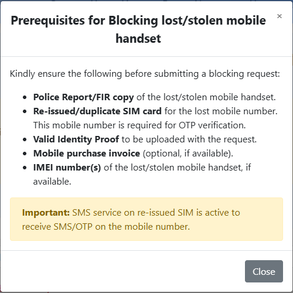
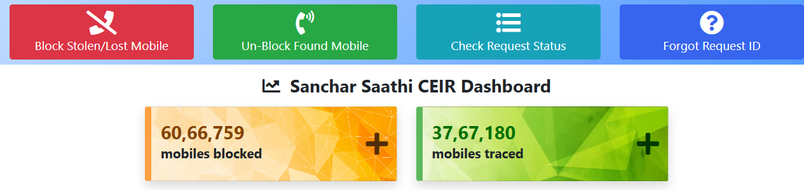
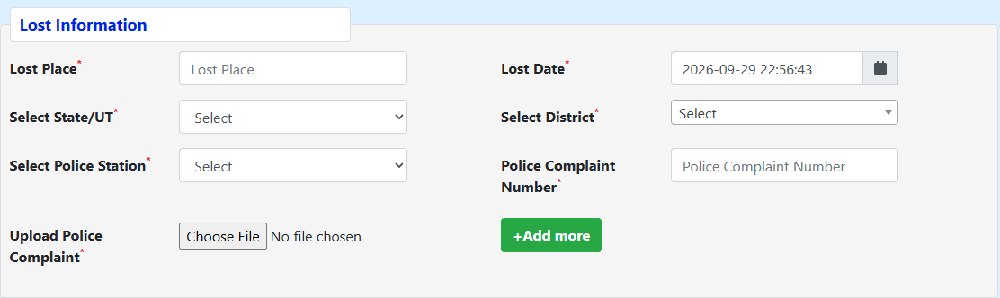

# How to Block a Lost or Stolen Phone in India with Sanchar Saathi (CEIR)

If your phone has just been lost or stolen, the order of what you do in the next hour matters more than any single step. Try to locate and lock it first, while it may still be switched on. Then cut off your SIM, secure your money, get a police report, and only then block the handset on the government's CEIR portal. That last step turns the phone into a useless brick on every Indian mobile network, and it can alert the police if someone puts a new SIM in it.

This guide walks through that sequence, the CEIR form section by section, and what the official numbers say about your chances of getting the phone back.

<!-- AUTHOR: If you or someone you know has been through this, one or two sentences on what surprised you (the police station visit, the wait for the duplicate SIM) would make the opening more personal. -->

## The first hour, in order

Each step below is placed where it is for a reason. Doing them out of order is the most common way people lose time.

1. **Try to locate the phone.** On Android, open Google's Find Hub (it was called Find My Device until recently) at [google.com/android/find](https://www.google.com/android/find) and sign in with the Google account that was on the phone. On an iPhone, use Find My at icloud.com/find or on another Apple device. You'll see a live location only while the phone is on and online, which is why this comes first: a thief's first move is usually to switch it off.
2. **Lock it and put a message on the screen.** Find Hub's "Mark as lost" [locks the phone with your PIN, pattern or password](https://support.google.com/android/answer/6160491?hl=en). Apple's Mark As Lost [locks the device, shows your message, and suspends the cards in Apple Pay](https://support.apple.com/en-sg/guide/findmy-mac/fmm0e3934777/mac). Add a contact number in case someone honest finds it.
3. **Decide about erasing, but don't rush it.** A remote factory reset protects your data, but Google notes that once you reset a device, [it no longer appears in Find Hub](https://support.google.com/android/answer/6160491?hl=en). If the phone may only be misplaced, keep tracking it for a while. If you're sure it's stolen and it holds sensitive data, erase it.
4. **Block the SIM and ask for a replacement with the same number.** OTPs, UPI and bank alerts follow your number, not the handset. Jio has a [lost-SIM page](https://www.jio.com/selfcare/lost-login/) where you can suspend the number. Airtel's own guide lists [198 or 121 from another Airtel number, or 1800 103 4444, plus the Thanks app and stores](https://www.airtel.in/blog/prepaid/how-to-block-airtel-sim-card/). Every operator can do it at a store with your original ID. Ask for the duplicate SIM in the same visit, because the CEIR form sends its OTP to that number.
5. **Secure your money.** Call your bank to block UPI and card access from the old device, and change the passwords of your email and banking apps from another device. Our guide to [how UPI fraud happens](https://techpulzo.in/how-upi-fraud-actually-happens-the-five-warning-signs) covers what criminals try after getting a phone and SIM.
6. **Get a police report.** CEIR requires a police complaint number and a copy of the complaint (more on this below).
7. **Block the phone on CEIR.** This is the step this guide is mostly about.

## What blocking the IMEI does, and what it doesn't

Every phone has an IMEI, a 15-digit hardware identity. A dual-SIM phone has two, because [an IMEI is assigned to each SIM slot](https://www.ceir.gov.in/Home/index.jsp). Each Indian operator keeps an Equipment Identity Register (EIR), a list of IMEIs it refuses to serve. CEIR, the Central Equipment Identity Register run by the Department of Telecommunications, [shares a blacklist across all operators' EIRs](https://www.ceir.gov.in/Home/index.jsp), so a phone blocked on one network is refused by every other network too, whatever SIM is put in it.

So once your request goes through:

- **The phone can't make calls, send SMS or use mobile data on any Indian network.** CEIR's FAQ says a phone is blocked within 24 hours of a successful request.
- **It can still be traced.** The same FAQ notes that blocking does not stop the police from tracking the phone. When a SIM is inserted into a blacklisted handset, the network sees it, and that information reaches the police.
- **It doesn't touch Wi-Fi or your data.** The EIR blocks service based on the IMEI the phone sends to the mobile network. A blocked phone can still join a Wi-Fi network, and nothing on the device is erased. That's why steps 2 and 3 above matter.
- **Changing the IMEI is a crime.** Under [Section 42(3) of the Telecommunications Act, 2023](https://www.advocatekhoj.com/library/bareacts/telecommunications/42.php), tampering with a telecommunication identifier such as an IMEI can bring up to three years in prison, a fine of up to ₹50 lakh, or both.

## What you need before opening the form

The form's own prerequisites pop-up lists the documents. Gathering them first saves a failed submission.

*The checklist the CEIR form shows before you start. Note that the IMEI is marked "if available". Source: ceir.gov.in*

| Item | Why it's needed | Where to get it |
|---|---|---|
| Police report or FIR, with its number | The form won't accept a request without a complaint number and an uploaded copy | Police station, or your state police's online lost-report or e-FIR service |
| Re-issued SIM for the lost number | The OTP goes to this number | Your operator's store, with original ID |
| Identity proof (a scan or photo) | You upload it as the owner | Aadhaar, PAN, voter ID, driving licence or another ID |
| IMEI number(s) | Identifies the exact handset | Box, invoice, or your Google/Apple account (below) |
| Purchase invoice | Optional, but it helps when police hand a recovered phone back | Your email or the shop |

**The 24-hour SMS catch.** CEIR's FAQ points out that, under TRAI rules, SMS on a re-issued SIM starts working only 24 hours after activation. If the OTP never arrives, this is usually why. Get the duplicate SIM as early as you can.

### Finding the IMEI when the phone is gone

- **The box.** The IMEI is printed on the barcode label on the side or back of the box.
- **The invoice.** Most retailers and online stores print it.
- **iPhone.** Apple's support page explains that you can [see the IMEI for any device signed in to your Apple Account](https://support.apple.com/en-us/108037): sign in at account.apple.com, open Devices, and select the phone.
- **Android.** One of the creators we watched found an IMEI listed in Google's device tool, but only for one of his two SIM slots. Check your Google account's device list from another device.

If you truly can't find it, the form still lets you submit, because the IMEI field is marked "if available". Presumably operator records can connect your number to the handset it was last used in. Still, enter both IMEIs if you have them.

### Getting the police report

Theft and loss are recorded differently. In Delhi, for example, the police run a Lost Report app that issues a digitally signed report within minutes, but [its FAQ says it is not an FIR](https://lostfound.delhipolice.gov.in/LostApp/faq.pdf), and theft is meant to go through the separate [property theft e-FIR](https://propertytheft.delhipolice.gov.in/) service. Many other states have similar online services, so check your state police website before going to the station.

If you do visit in person, the Technoside creator's experience is common. The station suggested writing it up as "lost" rather than stolen, and gave a station diary entry number instead of an FIR number. That number was enough for the CEIR form. Whatever you get, make sure it's written down with a number and a copy you can photograph.

## Filling in the block request, step by step

Open [ceir.gov.in](https://www.ceir.gov.in/Home/index.jsp) or [sancharsaathi.gov.in](https://sancharsaathi.gov.in/Home/ceir-services.jsp). Both lead to the same services, and there is also a Sanchar Saathi app on Android and iOS. Choose **Block Stolen/Lost Mobile**.

*The four CEIR services. Keep the request ID you get after blocking, because the other three depend on it. Source: ceir.gov.in*

The form has three sections. Fields marked with a red asterisk are mandatory.

**Device information.** Enter the lost mobile number (Mobile Number 1), and a second number if it was a dual-SIM phone. Enter IMEI 1 and IMEI 2, then select the brand and model and give an approximate price. The invoice upload is optional.

**Lost information.** This is where requests get rejected or delayed, so match it exactly to your police report.

*Use the same place, date, time and police station that appear on your police complaint. Source: ceir.gov.in*

- **Lost place** is a short description of where it happened, like a market name or bus route.
- **Lost date** includes a time. Use the one on your complaint.
- **State, district and police station** must be the station that registered your complaint.
- **Police complaint number and upload** are the FIR, lost-report or diary-entry number, plus a photo or PDF of the document.

**Owner's personal information.** Enter the name and address, choose an ID type, and upload it. Then solve the captcha, request the OTP on your re-issued number, tick the declaration, and submit.

You'll get a **request ID**. Save it somewhere other than your phone: in an email to yourself, or on paper.

## After you submit

- **Within 24 hours** the IMEI should be blacklisted. Use **Check Request Status** with your request ID to confirm the request was processed.
- **Verify both IMEIs.** The portal's IMEI verification check (the "Know Your Mobile" service) shows whether a number is blocked. After blocking, the Technoside creator found IMEI 1 showing as blocked but IMEI 2 still showing as active. We couldn't find an official explanation of how CEIR handles the second IMEI. If you see the same thing, raise it with the police station that registered your complaint, and quote your request ID.
- **"Request already exist … by State police."** If you see this message, the police have already blocked the phone through their own CEIR access. That's fine, but it means any unblocking will also have to go through the police.
- **If the phone is traced,** the alert goes to the police. The infosuch channel describes getting an SMS and being called to the station to collect the phone after signing a short application.

## Will you get the phone back? What the official numbers say

CEIR publishes its running totals. As of 24 September 2026, the portal showed **60,66,759 phones blocked, 37,67,180 traced and 13,93,213 recovered**.

Note that the "recovery percentage" the portal shows (36.98%) is recovered phones as a share of *traced* phones, not of blocked ones. Measured against every phone that was blocked, the national figure is about **23%**, or roughly one in four.

The state-by-state table on the same page shows a pattern the national figure hides. We calculated both ratios for some of the larger states:

| State / UT | Phones blocked | Traced (share of blocked) | Recovered (share of blocked) |
|---|---|---|---|
| Andhra Pradesh | 2,33,609 | 61.1% | 35.7% |
| Uttar Pradesh | 5,53,459 | 62.0% | 30.1% |
| Karnataka | 6,03,735 | 57.4% | 28.0% |
| Tamil Nadu | 2,82,672 | 64.1% | 27.6% |
| Telangana | 5,54,906 | 58.9% | 26.3% |
| Maharashtra | 7,35,434 | 57.9% | 24.0% |
| West Bengal | 2,92,564 | 58.5% | 16.5% |
| NCT Delhi | 10,63,224 | 62.9% | 5.1% |
| **All India** | **60,66,759** | **62.1%** | **23.0%** |

*Source: CEIR statistics by State/UT on ceir.gov.in, as of 24-09-2026. Percentages calculated from the published counts.*

The tracing rate is remarkably similar everywhere, at about 57–64%. The system finds blocked phones about equally well across the country. What changes enormously is how many traced phones actually get recovered: more than half in Andhra Pradesh, about one in twelve in Delhi. That's our inference from the published numbers, not an official explanation. But it suggests that once a phone is traced, what happens next depends largely on local police follow-up. If you're told your phone was traced, keep in touch with the station.

Two takeaways. Blocking is worth doing even if you never see the phone again, because it makes stolen phones worth less to thieves and keeps your number from being misused. And your odds of recovery are real but modest, so plan for the replacement.

## If the phone turns up: unblocking without mistakes

CEIR's FAQ is clear that you should unblock the IMEI only once the phone is found and **in your possession**, and after telling your local police that it has been found. Then:

1. Choose **Un-Block Found Mobile** on the portal. If you've lost the request ID, use **Forgot Request ID** with the mobile number and an OTP.
2. Enter the request ID and mobile number, and choose a reason. The infosuch walkthrough shows options for recovered by police, found by yourself, blocked by mistake, and other.
3. Confirm with the OTP and submit. Note the new request ID for the unblock.

If the block was registered by the state police, the portal can't undo it. You'll need to go back to them.

One warning from the infosuch creator is worth repeating: don't unblock because someone tells you it will help find the phone. A blocked phone is useless to whoever has it, and traced phones generate alerts. Unblocking early throws both of those away. The creator also reports that unblocking usually takes effect within 24 to 48 hours. We couldn't confirm a timeline on the portal itself.

## Mistakes that cost people time

- **Filling in a different number for the OTP.** Use the re-issued lost number. It's the one tied to your complaint and the one that will get future alerts.
- **Trying the OTP too soon.** Allow for the 24-hour SMS delay on a new duplicate SIM.
- **Mismatched details.** A different date, time or police station from the complaint copy invites rejection.
- **Erasing the phone while it's still findable.** After a reset it drops out of Find Hub. Erase once you've given up on locating it.
- **Leaving IMEI 2 blank on a dual-SIM phone** when you have it. Enter both and verify both afterwards.
- **Losing the request ID.** It's recoverable, but only with OTP access to the same number.

## Set this up today, before you need it

A few minutes now makes all of the above much easier:

- **Write down both IMEIs.** Dial `*#06#` and save the numbers somewhere that isn't the phone, like an email to yourself or a note with the invoice.
- **Turn on Android's theft protection.** Under *Settings > Google > All services > Theft protection*, Google offers [Theft Detection Lock](https://support.google.com/android/answer/15146908?hl=en), which locks the screen if the phone is snatched, Offline Device Lock, and Remote Lock, which lets you lock the phone from android.com/lock with just your phone number.
- **On iPhone,** make sure Find My is on, and turn on [Stolen Device Protection](https://support.apple.com/en-in/120340) under *Settings > Face ID & Passcode*. Away from familiar places, it requires Face ID or Touch ID with no passcode fallback for things like saved passwords, and adds an hour's delay before your Apple Account password can be changed.
- **Use a screen lock and app locks for banking apps,** and switch on [two-factor authentication](https://techpulzo.in/how-two-factor-authentication-actually-stops-account-hacks) for your email. Then a thief who gets past the lock screen still can't take over your accounts.
- **Know where the box and invoice are.**

<!-- AUTHOR: If you've checked your own IMEIs with *#06# while writing this, a one-line note on where you saved them would make this list feel less like a checklist. -->

## Frequently asked questions

### Can I block my phone on CEIR without an FIR?

You need some police complaint with a number, because "Police Complaint Number" and "Upload Police Complaint" are mandatory fields on the form. The form doesn't insist on a theft FIR specifically. In the Technoside case described above, a station diary entry number was accepted. Several states issue lost reports online, which is the fastest route if yours does.

### How long does it take for the phone to be blocked?

CEIR's FAQ says the phone is blocked within 24 hours of a successful request. The slower part is usually before you submit: getting the police report and waiting up to 24 hours for SMS to start working on the duplicate SIM, so the OTP can arrive.

### Does blocking the IMEI help the police find my phone?

It can. A blocked phone can't be used with any SIM in India. When someone tries, the network records the attempt and CEIR passes it to the police. Nationally, about 62% of blocked phones have been traced. Recovery after tracing varies widely by state, from above 50% of traced phones in some states to under 10% in Delhi.

### Does this work for iPhones?

Yes. CEIR works on the IMEI, which every phone has, whatever the brand. On an iPhone you can find the IMEI under Settings > General > About, or through your Apple Account device list if the phone is gone.

### What happens if I get my phone back but it shows no network?

The IMEI is still blacklisted. Tell the police station that the phone has been found, then submit an unblock request on the portal with your original request ID, or through the police if they registered the block. Service returns once the unblock is processed across operators.

## Write down your IMEI tonight

Almost every delay in this process comes from not having one of three things ready: the IMEI, a police complaint number, or a working duplicate SIM. You can't pre-arrange the last two, but the first takes thirty seconds. Dial `*#06#`, save both numbers somewhere off the phone, and switch on your phone's theft protection while you're at it.
