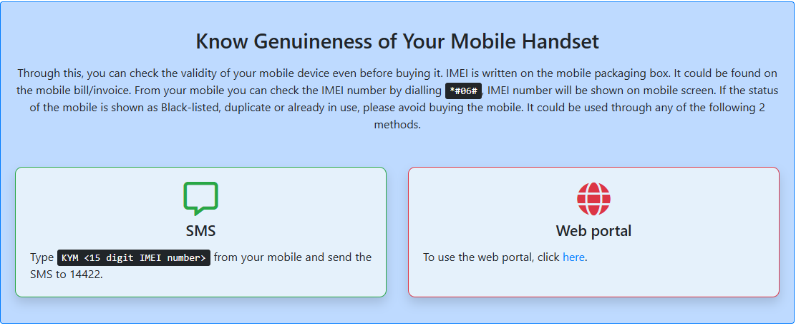
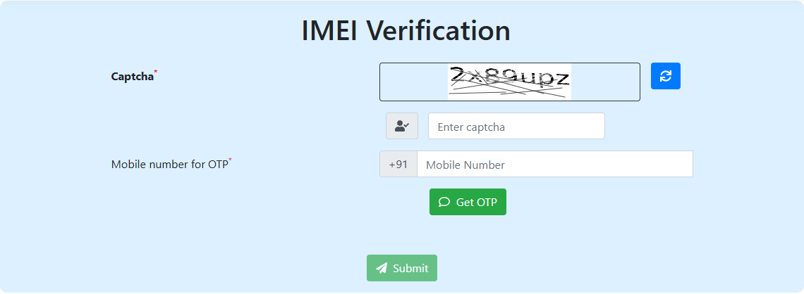

# How to Check a Used Phone's IMEI Before You Buy It (and What the Result Means)

Before you hand over money for a second-hand phone, spend one minute on the Department of Telecommunications' IMEI check. It tells you whether the phone has been reported lost or stolen and blacklisted on Indian networks. A blacklisted phone won't work with any SIM, and it can bring a police notice to whoever ends up using it.

The check is free and needs nothing but the phone's IMEI. Here's how to do it properly: get the right number, read the result correctly, and cover the things the IMEI check can't tell you.

## Step 1: Get the IMEI from the phone itself, both of them

Ask the seller to dial `*#06#` on the phone while you watch. The IMEI (a 15-digit number) appears on screen. A dual-SIM phone shows two, because, as the [Sanchar Saathi FAQ](https://sancharsaathi.gov.in/Home/index.jsp) puts it, dual-SIM phones have two IMEI numbers, one per SIM slot. Note down or photograph both.

Then compare them with:

- **The phone's settings.** On Android it's usually under *Settings > About phone*; on iPhone, *Settings > General > About*.
- **The box label and the purchase bill,** if the seller has them. The CEIR portal notes that the IMEI is printed on the box and can be found on the invoice.

All of these should match. If the number on the box or bill doesn't match the phone, either the box belongs to a different phone or something about this one has changed. Neither is a good sign. And a phone that shows an IMEI of all zeros, or none at all, is a clear no: the FAQ says handsets with all-zero or invalid IMEIs aren't allowed to work on Indian networks.

## Step 2: Check the IMEI with the DoT, three ways

The official service is called **Know Your Mobile (KYM)**, or "Know Genuineness of Your Mobile Handset". It runs on the same system that blocks lost and stolen phones.


*The official instructions on the CEIR site, including the advice to avoid buying a phone that shows as black-listed, duplicate or already in use. Source: ceir.gov.in*

**By SMS, the quickest at a meet-up.** From any phone, send:

```
KYM 123456789012345
```

to **14422**, replacing the digits with the IMEI. You'll get a reply with the result. Send one SMS for each IMEI.

**On the website.** Open [CEIR IMEI Verification](https://www.ceir.gov.in/Device/CeirImeiVerification.jsp). Enter the captcha and a mobile number for the OTP, which can be your own; it doesn't need to be linked to the phone you're checking. After the OTP, you'll be asked for the IMEI.


*The verification form asks for a captcha and an OTP to any mobile number before it shows the IMEI field. Source: ceir.gov.in*

**In the Sanchar Saathi app.** The app on Android and iPhone has the same "Know genuineness of your mobile handset" option.

Check **both** IMEIs on a dual-SIM phone. The CyberSafe Rajasthan video, from a police-run awareness channel, recommends this because a theft report is sometimes filed against only one of a phone's two IMEIs.

## Step 3: Read the result correctly

The verification returns the phone's details and its status. According to the FAQ, the details include the **manufacturer, device type, brand and model**.

| What you see | What it means | What to do |
|---|---|---|
| Valid, and the brand and model match the phone in your hand | Not reported, and the IMEI belongs to this kind of phone | Continue with the other checks below |
| Valid, but the brand or model is different | The IMEI shown on the phone belongs to a different device, which suggests it has been altered | Don't buy |
| Black-listed | Reported lost or stolen and blocked | Don't buy. See "If the result is bad" |
| Duplicate, or already in use | The same IMEI is registered to another phone, a sign of cloning or tampering | Don't buy. The CEIR site specifically advises against it |
| Invalid, or no details found | The number isn't recognised as a genuine IMEI | Don't buy |

The model match matters as much as the status. A stolen phone with a changed IMEI can come back "valid". But if the valid IMEI belongs to a completely different model, the check has done its job.

In the CyberSafe Rajasthan walkthrough, a blacklisted IMEI came back with a line in red telling the user not to use the device without permission. If you see anything like that, walk away.

## What the IMEI check can't tell you

A clean IMEI means the phone isn't on India's blacklist. It doesn't mean you'll be able to use it. Two account locks can make a perfectly clean phone useless to you.

**iPhone: Activation Lock.** Apple's guide for [buying a preowned iPhone](https://support.apple.com/en-us/104999) says that if the phone shows **"iPhone Locked to Owner"** when you turn it on, you shouldn't buy it until the seller removes it with their Apple Account password. If you see the multilingual **"Hello"** setup screen, the phone has been erased, which is what you want. If it opens to a home screen or lock screen, it hasn't been erased yet. Ask the seller to sign out of their Apple Account and erase it in front of you.

**Android: Factory Reset Protection.** Google explains that after a reset, a protected phone asks for [a Google Account that was previously synced to it](https://support.google.com/android/answer/9459346?hl=en), and you can't use the phone at all without it. Ask the seller to remove their Google Account under *Settings > Accounts* (the name varies by brand) **before** resetting the phone. Then set it up with your own account before you leave.

The rule for both: **don't pay until the phone is signed out, erased, and has started setting up with your own account.**

## The rest of the meet-up checklist

The IMEI and account checks deal with legitimacy. These deal with condition. The Serg Tech checklist covers the basics well, and they apply anywhere:

1. **Look it over** for cracks, bent frames, swollen backs (a sign of a failing battery) and dust inside the camera glass.
2. **Test the hardware:** call someone (earpiece and microphone), play music (speakers), record a video on each camera, and plug in a charger to check the port.
3. **Check battery health.** iPhones show it under *Settings > Battery*. Many Android phones show it in battery settings, or through the manufacturer's diagnostics app. Our explainer on [why phone batteries degrade](https://techpulzo.in/why-your-phone-battery-degrades-over-time-the-real-chemistry) covers what a low figure means for daily use.
4. **Check warranty status** with the serial number or IMEI on the manufacturer's site. This also confirms roughly when it was first sold.
5. **Get paperwork:** the original bill if there is one, and a simple handwritten sale note with the date, price, IMEIs, and the seller's name and phone number, signed by both of you. Photograph the seller's ID if they're willing.

For deciding whether a used flagship beats a new mid-range phone at the same price, see our [budget smartphone buying guide](https://techpulzo.in/top-5-budget-smartphones-of-2026-full-buying-guide). If you're not in a hurry, [India's sale calendar](https://techpulzo.in/best-time-of-year-to-buy-electronics-in-india-what-the-sales-calendar-shows) can close much of the gap between used and new prices.

## Why this matters beyond wasted money

Buying a stolen phone isn't only a bad deal.

- Under **Section 317(2) of the Bharatiya Nyaya Sanhita**, receiving or keeping stolen property while "knowing or having reason to believe" it's stolen can bring up to three years in prison, a fine, or both ([BNS 317](https://devgan.in/bns/section/317/)). A blacklisted IMEI result is exactly the kind of thing that gives you reason to believe.
- Under **Section 42(3)(f) of the Telecommunications Act, 2023**, wilfully possessing radio equipment while knowing it uses tampered identifiers, like a phone with a changed IMEI, carries up to three years, a fine of up to ₹50 lakh, or both ([Telecom Act s.42](https://www.advocatekhoj.com/library/bareacts/telecommunications/42.php)).
- **Your SIM can drag you in.** A mobile technician in the Repair My Mobile video describes how, when police examine a stolen phone's call records, they can see every SIM used in it, and the owners of those SIMs get notices. He also describes a district cyber-cell guideline telling repair shops to check IMEIs before working on a phone. We couldn't verify the specific guideline, but the point stands: don't put your SIM into a phone before it has passed the check.

None of this is legal advice. The practical takeaway is simple: a documented check (a screenshot of the valid result with matching model, and a sale note) is your best evidence that you bought in good faith.

<!-- AUTHOR: If you've bought or sold a used phone yourself, a line on which of these checks the other person expected (or didn't) would ground this section in real experience. -->

## If the result is bad

- **Don't buy it, and don't argue about it.** Politely say the phone didn't pass the government check and leave.
- **Don't try to "help" by inserting your SIM** to prove it works. That links your number to the phone.
- **If you're a shop or technician,** the Repair My Mobile creator's advice is to note the details and pass them to the local police station rather than confronting anyone.
- **If you already bought it,** stop using it, keep your sale note and payment record, and speak to the nearest police station. Don't try to unblock or "fix" the IMEI, because tampering is an offence in itself.

## Frequently asked questions

### Is the KYM check free?

The web portal and the Sanchar Saathi app don't charge anything; all you need is an OTP. The SMS option is sent from your own number like any other text.

### Can I check an IMEI without the seller's mobile number?

Yes. The OTP on the verification page goes to whichever number you enter, which can be your own. Only the IMEI needs to come from the phone you're buying.

### The IMEI shows as valid. Is the phone definitely not stolen?

Not definitely. It means no lost or stolen report has been registered against that IMEI, or none has been processed yet. A phone stolen yesterday may not be blocked until the owner files a report. That's another reason to insist on the bill or a signed sale note, and to be wary of a price that seems too good.

### What if the seller says the phone lost its IMEI after a repair?

Walk away. Phones with blank or invalid IMEIs aren't allowed on Indian networks, and changing an IMEI is an offence under the Telecommunications Act. A genuine motherboard replacement at an authorised service centre comes with paperwork.

### Does this work for iPhones?

Yes. The KYM check works on any phone's IMEI. For iPhones, also check Activation Lock as described above. That is the most common reason a "clean" used iPhone turns out to be unusable.

## Sixty seconds, before the money moves

The order matters: IMEIs from `*#06#`, the KYM check with a matching model, account sign-out and erase, then hardware, then payment. A seller with nothing to hide won't mind any of it. One who suddenly needs to leave has told you what you needed to know.
