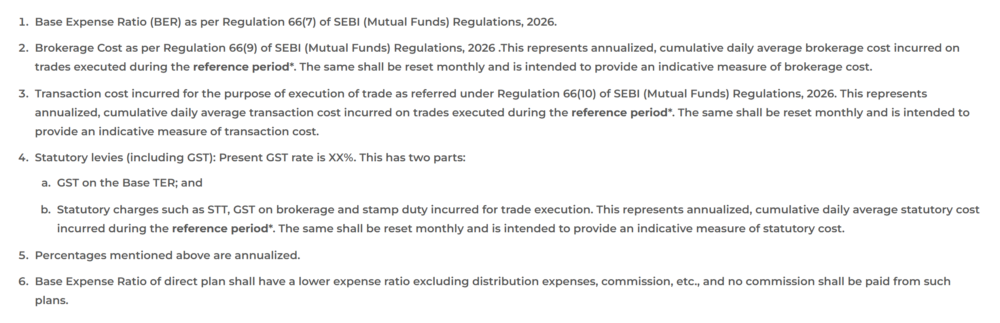

# Direct vs regular mutual funds: what the commission costs you, and how to switch

A direct plan and a regular plan of the same mutual fund hold the same shares, are run by the same fund manager, and follow the same strategy. The only difference is that the regular plan also pays a commission to whoever sold it to you, and that commission comes out of your returns every single day. So the direct vs regular mutual fund question comes down to two numbers: how big that commission is for your fund, and what you get in exchange for it.

This article works out both. It uses the expense ratios that every fund house reported to AMFI for September 2026, prices the gap in rupees over 10 to 30 years, and then walks through switching an existing regular investment to direct without handing a large part of the saving to the tax department.

## What is different between a direct and a regular plan

Every mutual fund scheme in India has two versions. SEBI made this compulsory from 1 January 2013: its [September 2012 circular](https://www.sebi.gov.in/sebi_data/attachdocs/1347547815927.pdf) requires every scheme to offer a separate plan for investments that don't come through a distributor, with "a lower expense ratio excluding distribution expenses, commission, etc.", no commission paid out of it, and its own NAV.

That last part matters. Because the two plans carry different costs, they have different NAVs (net asset value, the price of one unit). Money you put into the regular plan buys units of the same portfolio, but those units grow a little slower, because a slightly bigger slice is deducted each day.

### Where the commission hides

The cost of running a fund is expressed as the **expense ratio**: a yearly percentage of your investment. You never pay it as a separate bill. The fund takes a little of it from its assets each day, so it is already inside the NAV you see. A 1.6% expense ratio on ₹1 lakh means about ₹1,600 a year leaves your investment, quietly. It works like the fees folded into a loan's interest rate: easy to miss in a single figure, which is why [comparing a loan by its APR](https://techpulzo.in/how-to-read-a-loan-apr-instead-of-just-the-emi) instead of its EMI tells you more.

From April 2026 the rules split this into clearer parts. Under [SEBI's revised framework](https://www.sebi.gov.in/sebi_data/attachdocs/dec-2025/1765977060104.pdf), the fund house's own charges, including the distributor's commission in regular plans, form the **Base Expense Ratio** (BER). Brokerage, GST, stamp duty and other levies are added on top to give the total expense ratio. The BER has a legal ceiling that shrinks as the fund grows: 2.10% for an equity scheme with assets up to ₹500 crore, falling in steps to 0.95% for the part of assets above ₹50,000 crore, and 0.90% for index funds and ETFs.

*The notes under AMFI's TER lookup. Point 6 is the rule that separates the two plans. Source: amfiindia.com*

AMFI's [TER of MF Schemes](https://www.amfiindia.com/ter-of-mf-schemes) page lets you look up both plans of any scheme, month by month. It is the quickest way to see what a fund you already own is costing you.

## How big the gap is this month

"About 1%" is the figure most explainers quote. To check it, we pulled every scheme's expense ratios from [AMFI's TER disclosure](https://www.amfiindia.com/ter-of-mf-schemes) for September 2026 and compared the two plans of each scheme on the last reported day of the month. That covers 1,671 schemes, leaving out ETFs, which trade on the exchange and don't have a meaningful direct plan. The figures are total expense ratios, including GST and other levies.

| Type of fund | Schemes | Typical regular plan | Typical direct plan | Typical gap |
|---|---|---|---|---|
| Large cap | 35 | 2.20% | 1.06% | 1.08 points |
| Mid cap | 34 | 2.03% | 0.96% | 1.10 points |
| Small cap | 36 | 2.06% | 0.91% | 1.19 points |
| Flexi cap | 46 | 2.17% | 0.92% | 1.22 points |
| ELSS (tax saver) | 39 | 2.16% | 1.10% | 1.09 points |
| Sectoral / thematic | 256 | 2.40% | 1.16% | 1.25 points |
| Balanced advantage | 37 | 2.31% | 1.04% | 1.25 points |
| Index funds | 355 | 0.99% | 0.37% | 0.49 points |
| Short duration debt | 25 | 0.99% | 0.37% | 0.61 points |
| Liquid | 43 | 0.25% | 0.13% | 0.10 points |

*"Typical" is the median for each category. Source: AMFI TER data, September 2026; our analysis.*

Three things stand out:

- **For actively managed equity funds, the gap is a little over 1 point, not under it.** In these categories the middle half of funds mostly sits between about 0.7 and 1.5 points. In most of them the regular plan costs more than twice as much as the direct plan.
- **Index funds have a smaller gap but a bigger multiple.** Half a point looks minor until you see that the regular plan typically costs about 2.7 times the direct plan, for a fund whose whole appeal is low cost.
- **For liquid and overnight funds the difference is close to nothing.** If your regular holding is parked cash in a liquid fund, switching barely changes your returns.

## What the gap does to your money over 10 to 30 years

A gap of about one percentage point looks harmless in a single year. It is charged on your whole balance, though, including the gains from earlier years, so it compounds against you.

Take a ₹15,000 monthly SIP for 20 years in an equity fund that earns 12% a year before costs, with the direct plan charging 1%, close to the typical figure above:

| Regular minus direct expense ratio | Direct plan after 20 years | Regular plan after 20 years | Difference |
|---|---|---|---|
| 0.50 points (typical index fund) | ₹1.22 crore | ₹1.15 crore | ₹7.1 lakh |
| 1.10 points (typical large/mid cap) | ₹1.22 crore | ₹1.07 crore | ₹15.0 lakh |
| 1.25 points (typical flexi cap, thematic) | ₹1.22 crore | ₹1.05 crore | ₹16.9 lakh |

You put in ₹36 lakh either way. At a 1.1-point gap, the commission ends up costing about 40% of everything you invested. (Whether to run a monthly SIP or invest a lump sum is a separate decision, covered in [SIP vs lump sum](https://techpulzo.in/sip-vs-lump-sum-how-to-actually-decide-where-to-put-your-money); the cost gap applies to both.)

The size of the bite depends mostly on time. For a lump sum left alone, this is the share of the final value that a gap takes away (assuming 11% a year after the direct plan's costs):

| Years invested | 0.5-point gap | 1.1-point gap |
|---|---|---|
| 10 | 4.4% | 9.5% |
| 20 | 8.6% | 18.1% |
| 30 | 12.7% | 25.8% |

Zerodha's recent explainer video tells a similar story with two friends whose identical 20-year SIPs end about ₹14 lakh apart. Running its inputs (₹15,000 a month, 10.5% vs 9.5% after costs) gives a gap of ₹13 to 15 lakh depending on how monthly compounding is counted, so the scale holds up, even though the exact corpus figures in the video don't reproduce.

For money you already have in regular plans, the yearly cost is simple multiplication. On a ₹10 lakh holding in a regular active equity fund, a 1.1-point gap is about ₹11,000 this year, and it grows with the balance.

You can also see the exact figure for your own folios. Since October 2016, SEBI has required the [consolidated account statement](https://cafemutual.com/news/industry/6454-disclose-absolute-commissions-of-distributors-in-cas-sebi) (CAS) to show the commission paid to your distributor in rupees for each scheme, along with the plan's average expense ratio for the half-year. Across the industry these payments add up: [1 Finance's analysis](https://1finance.co.in/blog/mutual-fund-distribution-commission-india/) of AMFI disclosures puts distribution commission at ₹27,335 crore in a single year.

<!-- AUTHOR: If you've ever looked up the commission line on your own CAS, one sentence on what the rupee figure was and how it compared with what you expected would make this section land. -->

## When a regular plan is worth paying for

A regular plan pays for advice and service through the expense ratio instead of by invoice. Whether that is good value depends on whether the service turns up.

The commission is reasonable if your distributor:

- built your asset allocation around your goals rather than recommending whatever was popular that year;
- reviews the portfolio with you at least once a year and rebalances;
- talked you out of selling during a market fall, which on its own can be worth more than years of commission;
- handles paperwork you would otherwise skip: nominations, KYC updates, address changes.

If the relationship has become a phone call when there is a new fund to sell, you are paying for advice you aren't receiving.

There is a middle path that the Hindi-language explainer by CFA Sanjay Kathuria argues for: pay a fee-only adviser once (or yearly) to design the portfolio, then hold direct plans. SEBI-registered investment advisers can't take commissions, and their fees are capped by a [January 2025 SEBI circular](https://taxguru.in/sebi/sebi-updates-guidelines-investment-advisers-2025.html) at 2.5% of the assets they advise on, or ₹1,51,000 a year per family on a fixed fee. On a large portfolio, a fixed fee can work out far cheaper than a percentage commission that grows with your balance.

## How to check whether you hold direct or regular

1. **Look at the scheme name.** A direct plan always says "Direct" in its name, for example "… Flexi Cap Fund – Direct Plan – Growth". If it says "Regular" or doesn't mention either, it is the regular plan.
2. **Check your CAS.** The monthly statement from NSDL or CDSL (or from CAMS and KFintech if your PAN isn't linked to a demat account) [arrives by the 10th of the next month](https://www.amfiindia.com/investor/become-mf-distributor?zoneName=consolidatedAcct). Each holding shows the full scheme name, including the plan, and every half-year the statement adds the commission paid on it.
3. **Don't assume from the app.** Zerodha's Coin sells only direct plans, but in July 2026 Groww started offering regular plans through its subscription service, Groww Prime, as [Business Today reported](https://www.businesstoday.in/mutual-funds/story/zerodha-vs-groww-debate-are-direct-mutual-funds-always-better-or-is-advice-worth-paying-for-542346-2026-07-10). Check the plan name on each holding.

You would be in large company if you find regular plans. AMFI–CRISIL data reported by [Business Standard](https://www.business-standard.com/markets/mutual-fund/markets-mutual-fund-retail-investors-direct-plan-mutual-fund-aum-growth-126090600173_1.html) shows direct plans held 45.1% of all mutual fund assets in March 2026, and only 36.7% of money from retail investors, though that share has nearly doubled since 2021.

## How to switch to direct without a large tax bill

Moving from a regular plan to the direct plan of the same scheme is treated as selling one and buying the other. Two costs used to apply. One of them is gone.

### Exit load no longer applies to the switch

Older articles and videos (including two of the three used in researching this one) warn of a 1–2% exit load if units are under a year old. That changed in April 2025. Following an AMFI instruction, fund houses stopped charging exit load on a regular-to-direct switch within the same scheme from 21 April 2025; [HDFC Mutual Fund's addendum](https://files.hdfcfund.com/s3fs-public/2025-04/1294-%20Addendum-%20Discontinuation%20of%20levying%20exit%20load%20for%20switch%20of%20investments%20from%20Regular%20to%20Direct%20Plan.pdf) is a typical example. The exit-load clock keeps running from your original purchase date, so if you redeem the direct units inside the load period, the load still applies then.

### Capital gains tax still does

The switch is a sale for tax. For equity funds (65% or more in Indian shares), as [summarised by Bajaj Finserv AMC](https://www.bajajamc.com/knowledge-centre/common-things-to-know-about-ltcg-on-mutual-funds) for FY 2026-27:

| Units held | Tax on the gain |
|---|---|
| More than 12 months | 12.5%, but the first ₹1.25 lakh of such gains in a financial year is tax-free |
| 12 months or less | 20% on the whole gain |

Add 4% cess to both. The ₹1.25 lakh exemption covers all your long-term equity gains in the year combined, from shares and every fund, not ₹1.25 lakh per scheme.

Two details make this manageable. Units are redeemed first-in, first-out, and [each SIP instalment counts as a separate purchase](https://www.bajajamc.com/glossary/what-is-an-exit-load-in-mutual-funds) with its own holding clock. So if you switch only part of a holding, the oldest units go first, and those are the ones that qualify for the lower rate.

### A staged switch, worked out

Say you hold ₹8 lakh in the regular plan of an equity fund, with ₹2.6 lakh of gains, all on units older than a year, and no other equity gains this year. The direct plan is 1.1 points cheaper, the typical gap for an active equity fund.

- **Switch everything at once:** taxable gain ₹2.6 lakh − ₹1.25 lakh = ₹1.35 lakh; tax at 12.5% plus cess ≈ **₹17,550**. The annual saving is about ₹8,800, so the first two years of savings go to the tax.
- **Switch in two parts:** move units carrying ₹1.25 lakh of gain before 31 March, and the rest after 1 April. Year one is fully exempt; year two has ₹1.35 lakh of gain, of which only ₹10,000 is taxable, about **₹1,300**.

The same holding, moved a few weeks apart, saves over ₹16,000. With larger gains, spread it across three or four financial years. (This simplifies: the remaining units keep earning, so the second-year gain may be a little higher than at the start.)

The order of steps that keeps costs lowest, following the approach Kathuria describes:

1. **Redirect new money first.** Start a SIP of the same amount in the direct plan, confirm the first instalment has gone through, then cancel the regular SIP. Doing it in this order means no missed month.
2. **Leave units under 12 months old alone** until they cross a year. Switching them now means 20% tax on the whole gain.
3. **Each financial year, switch older units** until your total long-term equity gains for the year reach ₹1.25 lakh.
4. **Do the switch yourself.** Your distributor won't initiate it. Use the fund house's website or app, myCAMS or KFinKart (depending on which registrar services the fund), [MF Central](https://www.valueresearchonline.com/stories/228961/switch-regular-to-direct-mutual-fund-plan-tax-cost-how/), or a direct-plan platform that can see your existing folios. Select "switch", choose the direct plan of the same scheme, and confirm with the OTP. It usually completes in one to three working days.

<!-- AUTHOR: If you've switched one of your own folios, add which route you used (AMC site, MF Central, an app) and roughly how long it took. -->

### Debt funds and closed doors

Debt funds bought after 31 March 2023 have [no long-term rate](https://www.tatamutualfund.com/blogs/taxation-mutual-funds-what-every-investor-needs-know-stcg-ltcg-dividend-income-and-elss): every gain is taxed at your income slab, however long you held. Staging across years doesn't help there unless your income changes, so compare the tax on the gain with the yearly saving and switch only if it pays back within a few years.

Some international funds temporarily stop accepting new money when an overseas investment limit is reached. A switch counts as a fresh purchase, so it can't go through while the fund is closed. Stop the regular SIP and wait.

## Frequently asked questions

### Is a direct mutual fund safe?

It is exactly as safe as the regular plan of the same scheme, because both are the same pool of money with the same holdings, custodian and fund manager. Your units are registered in your name with the fund's registrar, whichever app or website you used to buy them. "Direct" only describes how you bought them and what you pay; it says nothing about the fund's risk. A small-cap fund is as volatile in its direct plan as in its regular plan.

### Can I switch from regular to direct if I invested through a bank?

Yes. The units belong to you, not to the bank, so you can switch them through the fund house's site, MF Central or the registrar's portal without asking the bank. You will need your PAN and the mobile number or email registered with the fund.

### Do I lose my investment history when I switch?

Your old regular units are redeemed and new direct units are bought, so the direct folio starts with a fresh purchase date and cost. For tax, that new date matters: the direct units need another 12 months to count as long-term. Your past returns aren't lost; they are realised as a gain at the switch, which is why staging the switch around the ₹1.25 lakh exemption is worth the effort.

### Should a beginner start with a regular plan?

Only if the person selling it will advise you properly over the years. If what you need is a simple start, an index fund or a flexi-cap fund in its direct plan, through a single SIP, needs very little ongoing decision-making. If you want someone to plan with you, a one-time session with a fee-only registered adviser costs a known amount instead of a percentage that grows every year.

### Does a direct plan always give higher returns than its regular plan?

Yes, for the same scheme over the same period, by roughly the difference in expense ratio each year. Both plans own the same portfolio, so the direct plan's lower cost is the only thing separating their returns. It doesn't mean every direct fund beats every regular fund: a well-chosen regular plan can still beat a poorly chosen direct one. The plan decides the cost; the fund decides the returns.

## Check one folio this week

You don't need to restructure everything at once. Download your CAS, find the line that shows commission paid, and look up that fund's two expense ratios on AMFI's page. If the rupee figure buys you nothing you value, redirect the SIP to the direct plan today and move the old units one financial year at a time.
