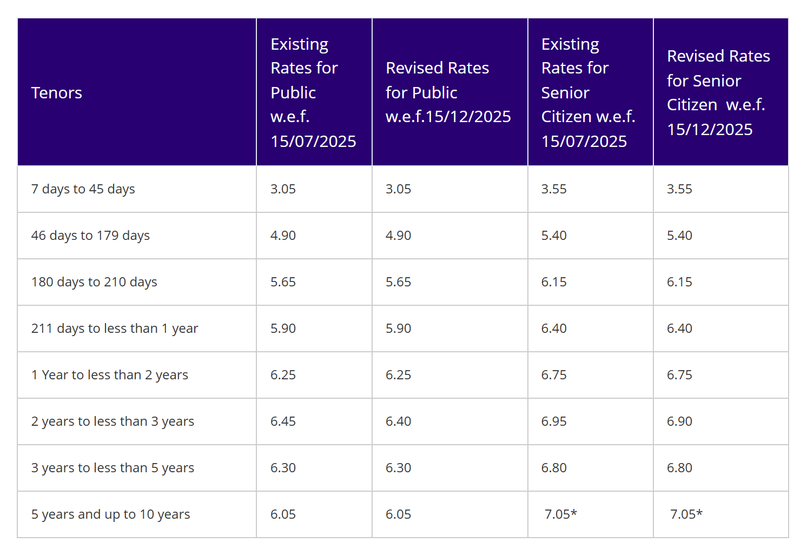

# How big your emergency fund should be, and where to keep it

"Six months of expenses" is the answer everyone repeats when you ask how much emergency fund you need. For many households it's measured against the wrong number, and it ignores the two things that matter most: how many incomes the household has, and what you would still have to pay if one of them stopped.

A better method takes about ten minutes. Add up the costs you couldn't cut in a bad month, multiply by the number of months your household could realistically need to cover, and then split the money by how fast you'd need each part of it.

## Start from what you would still have to pay

When an emergency hits, whether a job loss, an illness or a family crisis, most people cut spending immediately: no trips, fewer meals out, shopping postponed. The finance channel bekifaayati makes this point in its 2026 explainer: multiplying your full current spending gives an unrealistically large target. What the fund must cover is the spending that continues regardless.

That list is usually longer than people expect. NDTV Profit's interview with financial planner Dilshad Billimoria stresses two items that get left out: **loan EMIs** and **insurance premiums**. Neither stops when your salary does, and letting a health or term policy lapse in the middle of a crisis is the worst possible timing.

Here is a worked example for a household in a metro city where one person earns:

| Monthly cost that continues | Amount |
|---|---|
| Rent | ₹25,000 |
| Home or vehicle loan EMIs | ₹18,000 |
| Groceries, utilities, phone, internet | ₹14,000 |
| School fees (monthly equivalent) | ₹6,000 |
| Transport | ₹5,000 |
| A parent's regular medicines | ₹4,000 |
| Insurance premiums (yearly premiums ÷ 12) | ₹3,000 |
| **Essentials** | **₹75,000** |

The household actually spends about ₹95,000 a month. Sizing on ₹75,000 instead of ₹95,000 cuts a 12-month target from ₹11.4 lakh to ₹9 lakh, a difference that takes years to save.

A [zero-based budget](https://techpulzo.in/zero-based-budgeting-how-to-build-a-budget-that-actually-works) makes this list easy, because every rupee already has a label.

## How many months: decide by your household, not by a rule

The multiplier depends on how exposed your household is. Investment educator Rahul Jain suggests a simple table, which is a sensible starting point:

| | No financial dependents | 1–2 dependents | 3–4 dependents |
|---|---|---|---|
| One earner | 6 months | 12 months | 18 months |
| Two earners | 3 months | 6 months | 9 months |

*Rahul Jain's rule of thumb. "Dependents" means people who rely on you financially, not parents who still have their own income.*

Billimoria's version is broadly similar: about 12 months if only one spouse earns, 6 if both do. Then adjust for your own situation:

- **Move up** if your income is variable (commission, freelance, business), your industry is laying people off, your skills would take months to place, or you support parents with health problems.
- **Move down** if both earners work in stable jobs in different sectors, or if you have good health insurance. A ₹10 lakh family floater means a hospital bill is mostly the insurer's problem. Your fund then needs to cover the deductible, non-covered items and the deposit some hospitals ask for before cashless approval comes through.

In our example, one earner with a non-earning spouse, a child and a dependent parent lands at about 12 months: **₹9 lakh**.

<!-- AUTHOR: If you've ever had to live off savings for a stretch, a sentence on how long it lasted and what you cut first would ground this section. -->

## Where to keep it: three tiers by how fast you need it

An emergency fund has three jobs that pull in different directions: it must be **safe**, it must be **reachable quickly**, and it shouldn't lose too much to inflation while it waits. No single product does all three well, so split the money by how fast you would need each part.

| Tier | Holds | Where | Access | Recent return |
|---|---|---|---|---|
| 1. Same day | About 1 month | Savings account | Instant | 2.5% (SBI) |
| 2. This week | About 3 months | Auto-sweep or "flexi" FD linked to savings | Instant, in fixed units | FD rate for the tenure (6.25% for 1 year at SBI) |
| 3. Within days | The rest | Two or three liquid mutual funds | Up to ₹50,000 per fund within ~30 min; the rest next working day | About 6.5% in the past year |

### Tier 1: savings account

One month of essentials in a savings account handles the first days of almost any emergency. SBI pays [2.50% on savings](https://sbi.bank.in/web/interest-rates/savings-bank-deposits), which usually trails inflation, so keep this tier small.

### Tier 2: an auto-sweep fixed deposit

Many banks can sweep surplus savings into fixed deposits automatically and pull money back when your balance runs short. In SBI's version, the [Multi Option Deposit](https://sbi.bank.in/web/personal-banking/investments-deposits/deposits/mod), money above ₹50,000 in the savings account moves into deposits in units of ₹5,000. When you need cash, units are broken in ₹5,000 steps and credited back on their own. Only the broken units earn the reduced rate; the rest keep earning the original FD rate.

That reduced rate is worth understanding. SBI's [premature withdrawal rule](https://sbi.bank.in/web/interest-rates/interest-rates/deposit-rates) pays the rate for the period the money actually stayed, minus 0.5% (1% above ₹5 lakh). Short periods pay much less than a 1-year FD:

*SBI's current FD rates, effective 15 December 2025. Money withdrawn early earns the rate for the time it stayed, less a penalty. Source: sbi.bank.in*

Break ₹1 lakh after four months and you earn about 4.4% for that period instead of 6.25%: roughly ₹1,470 instead of ₹2,080. That's a small cost in a real emergency, and sweep units mean you only break what you need. If you prefer separate FDs, split the amount into several smaller ones (Jain suggests at least three) so one withdrawal doesn't break the whole sum.

Bank deposits are insured by [DICGC](https://www.dicgc.org.in/FAQs) up to ₹5 lakh per depositor per bank, including interest. If your emergency fund is larger, spreading the deposit tier across two banks keeps all of it inside the cover.

### Tier 3: liquid mutual funds

[Liquid funds](https://www.valueresearchonline.com/learn/debt-funds/liquid-fund-instant-redemption-rs-50000-limit/) invest in government and corporate debt that matures within 91 days, so their value barely moves from day to day. Over the year to 1 October 2026, the seven largest liquid funds (direct plans) returned between 6.46% and 6.57%, according to AMFI's published NAVs. That's slightly more than a 1-year FD, with no penalty for withdrawing early.

Two access rules matter:

- **Normal redemption** reaches your bank account on the next working day.
- **Instant redemption**, offered by many funds, is capped at ₹50,000 or 90% of your holding a day, whichever is lower. As [PPFAS Mutual Fund's terms](https://amc.ppfas.com/instant_access_facility/) spell out, that limit applies per scheme per day for each PAN. So Jain's suggestion of using two or three different liquid funds does work: three funds that offer the facility can put up to ₹1.5 lakh in your account within about 30 minutes, at any hour. It's only available to resident individuals whose units aren't held in a demat account.

Liquid funds aren't entirely load-free. SEBI allows a [tiny exit load](https://cafemutual.com/news/industry/17548-sebi-allows-graded-exit-load-in-liquid-funds) in the first week (0.007% on day one, nil from day seven), which is about ₹7 per ₹1 lakh. They also aren't covered by deposit insurance. Their safety comes from very short-term, high-quality holdings, which is why sticking to large, plain liquid funds matters more than chasing the top return.

Since April 2023, gains on debt and liquid funds bought after 31 March 2023 are [taxed at your slab rate](https://www.tatamutualfund.com/blogs/taxation-mutual-funds-what-every-investor-needs-know-stcg-ltcg-dividend-income-and-elss), the same as FD interest. The one remaining difference is timing: FD interest is taxed every year as it accrues, while a liquid fund is taxed only when you withdraw.

## What the tiers earn compared with a savings account

For the ₹9 lakh fund in our example:

| Tier | Amount | Return | Per year |
|---|---|---|---|
| Savings account (1 month) | ₹75,000 | 2.50% | ₹1,875 |
| Sweep FD (3 months) | ₹2,25,000 | 6.25% | ₹14,060 |
| Liquid funds (8 months) | ₹6,00,000 | 6.50% | ₹39,000 |
| **Total** | **₹9,00,000** | **6.1%** | **₹54,940** |

Kept entirely in a savings account, the same ₹9 lakh would earn ₹22,500. Tiering adds about ₹32,000 a year before tax, without giving up the ability to get money the same day. Past liquid-fund returns aren't guaranteed; they move with short-term interest rates, much as FD rates do.

## What doesn't belong in an emergency fund

- **Equity and index funds.** They can fall sharply exactly when you need them. Jain points to the Covid crash, when job losses and falling markets arrived together.
- **Long-tenure FDs, PPF, gold or property.** They're either locked in, penalised, or slow and uncertain to sell.
- **A credit card limit.** Zerodha Varsity and Billimoria both suggest a card as a bridge for the day or two before a redemption lands, which is reasonable if you repay it in full by the due date. As a substitute for savings, it becomes debt at around 45% a year plus GST.
- **Arbitrage funds.** Sometimes suggested as an alternative, but Billimoria notes many carry an exit load if you redeem within about a month.

## Building it and keeping it

At ₹20,000 a month, a ₹9 lakh target takes almost four years. That's normal, and building it in stages helps:

1. **First milestone: one month of essentials** in a savings account. This alone covers most car repairs, appliance failures and short gaps.
2. **Then three months**, in the sweep FD.
3. **Then the full target**, in liquid funds. Jain's advice is blunt: if you can't do both, pause new SIPs until the fund is at least partly built. Varsity suggests splitting your monthly savings between the two instead. Either works, as long as the fund comes first in priority.
4. **Review it every year or two.** Your EMIs, rent and fees rise; the fund should too.
5. **Refill it after you use it**, before resuming other investments.

## Frequently asked questions

### Should I keep my emergency fund in a savings account or an FD?

A mix works better than either alone. Keep about a month of essentials in savings for instant access, and the next few months in an auto-sweep FD, which earns FD rates but releases money automatically when your savings balance runs short. Separate FDs are fine too, but split them into several smaller ones so you never break the whole amount for a small need.

### Is a liquid fund safe enough for an emergency fund?

Large liquid funds are very low-risk because they hold high-quality debt maturing within 91 days, and their NAVs rarely fall. They are not bank deposits, though, and aren't covered by deposit insurance. That's a reason to keep the first few months in a bank and use liquid funds for the rest, and to choose large, well-known funds rather than the one with the highest recent return.

### How quickly can I get money out of a liquid fund?

Normally on the next working day after you redeem. Many funds also offer instant redemption: up to ₹50,000 or 90% of your holding, whichever is lower, per scheme per day, paid by IMPS within about 30 minutes, even at night or on holidays. Holding two or three schemes raises how much you can get instantly. Units held in a demat account aren't eligible.

### Do I need an emergency fund if I have health insurance?

Yes, but it can be smaller. Insurance covers the hospital bill, not the income you lose while you recover, your EMIs, or the deposit a non-network hospital may ask for before a reimbursement claim. Size the fund for those, and for non-medical emergencies like job loss, which no insurance covers.

### Should I stop my SIPs to build an emergency fund?

If you have nothing set aside, pausing or reducing SIPs for a while to build the first few months is reasonable. Without a fund, the first emergency often forces you to sell investments at a bad time anyway. Once you have three months of essentials in place, you can resume SIPs and build the rest of the fund alongside them.

## Size it once, then automate it

Add up the costs you couldn't cut, choose your months honestly, and set up the three tiers once: a savings floor, a sweep FD and two or three liquid funds. After that the fund mostly runs itself. It's worth comparing how a regular deposit habit would build the sweep tier; our explainer on [FDs versus recurring deposits](https://techpulzo.in/the-real-difference-between-a-fixed-deposit-and-a-recurring-deposit) covers that choice.
