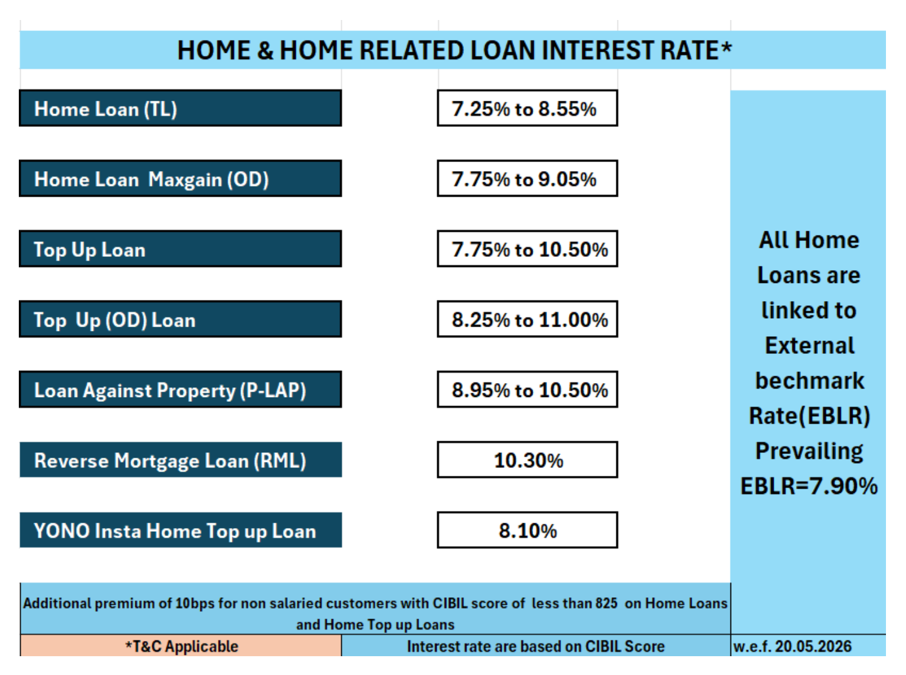

# Home loan prepayment: reduce the EMI or the tenure?

Every home loan prepayment comes with a question from the bank: reduce the EMI or the tenure? If you are sure you can keep paying your current EMI for years, tell the bank to cut the tenure. If you aren't sure, cut the EMI and keep paying extra whenever you can. The second route costs far less than most calculators suggest, because the gap between the two options comes almost entirely from one habit, not from the choice itself.

The rest of this article shows why with one realistic loan, then covers the Indian rules that should shape the decision in 2026: RBI's ban on prepayment charges, what your bank does to your tenure when rates rise, the ₹2 lakh tax cap on interest, and overdraft-style loans that let you prepay without giving up the cash.

## What each option does to a real loan

Take a ₹50 lakh home loan for 20 years at 7.75%, close to the middle of the range SBI quotes for new borrowers today.

*SBI's current rate card, effective 20 May 2026. Your rate within the range depends on your credit score. Source: sbi.bank.in*

The EMI is ₹41,047. Over 20 years you pay ₹48.5 lakh in interest, almost as much again as you borrowed. The reason is how an EMI is split: interest is charged on the outstanding balance each month, and early on the balance is at its largest. In the first month, ₹32,292 of the ₹41,047 (79%) is interest. Only about ₹8,750 reduces the loan.

Now say that after a year of EMIs you get a bonus and prepay ₹5 lakh. The bank applies it to the principal and asks what to do next:

| | Keep the EMI, cut the tenure | Keep the tenure, cut the EMI |
|---|---|---|
| New EMI | ₹41,047 (unchanged) | ₹36,851 (₹4,196 less) |
| Loan ends after | 195 months (16 years 3 months) | 240 months (unchanged) |
| Total interest | ₹34.8 lakh | ₹43.9 lakh |
| Interest saved | **₹13.7 lakh** | **₹4.6 lakh** |

Every calculator and most videos on this topic stop here and declare tenure reduction the winner by about ₹9 lakh. That conclusion leaves out one thing.

## Why the comparison is closer than it looks

The two rows above don't describe the same person. The tenure-cutter keeps paying ₹41,047 a month. The EMI-cutter pays ₹36,851 and the ₹4,196 difference goes somewhere else: groceries, school fees, an SIP, or nowhere in particular.

Give the EMI-cutter the same discipline. Take the lower EMI, and every month send the ₹4,196 back to the loan as an extra payment. Running that through the same calculation, the loan closes in **195 months with ₹34.8 lakh of interest**, identical to the tenure option to the month and the rupee.

That makes sense once you see it. The bank charges the same rate on the same balance either way. The only thing that changes is how fast you pay that balance down, and that depends on how much you pay each month, not on what the bank calls the arrangement.

So the ₹9 lakh "advantage" of cutting the tenure is really the price of spending ₹4,196 a month for 16 years. Cutting the tenure locks in the discipline. Cutting the EMI leaves it optional. Which one suits you is a question about your cash flow and your habits, and it's worth answering honestly.

## When lowering the EMI is the better call

Choose the lower EMI when flexibility is worth more to you than a commitment:

- **Your income is uneven or uncertain.** Commission-heavy jobs, a business, a contract role, or a company going through layoffs. A lower EMI is easier to keep paying through a bad stretch, and missed EMIs [damage your credit score](https://techpulzo.in/credit-score-in-india-how-it-works-and-how-to-fix-it) for years.
- **The EMI is already a large share of your take-home pay.** Lenders typically cap total EMIs at a share of your income, and our [home loan affordability guide](https://techpulzo.in/how-much-home-loan-you-can-actually-afford) explains why the comfortable level is lower than what the bank approves. Lowering the EMI makes room for the next need, whether that's a car loan or a child's admission fee.
- **You will reliably invest the difference.** If you put the ₹4,196 into an SIP and leave it there, you are betting that the investment beats your loan's 7.75% after tax over the years you hold it. That's a reasonable bet for long horizons, but it is a bet. Zerodha Varsity's video on the question points out that market returns depend heavily on when you start and stop, while interest saved on a loan is certain. It argues for prepaying when you are near retirement, the only earner in the family, or in an unstable job.
- **You'd rather prepay in irregular amounts.** With a lower EMI, you can still send extra money whenever it turns up, and every rupee of it shortens the loan. [ICICI Bank's FAQ](https://www.icici.bank.in/personal-banking/loans/home-loan/home-loans-faqs) notes that once you ask it to *raise* your EMI, the higher amount can't be lowered later except through a part-prepayment or a loan conversion. A lower EMI plus voluntary extras keeps that door open.

Choose the shorter tenure when you know the money would otherwise drift into spending, or when being debt-free by a particular date (before your child's college, before retirement) matters to you.

<!-- AUTHOR: If you've had to make this call on your own loan, a line on which you picked and what tipped it would help readers more than any rule. -->

## Prepay early, then keep a habit going

When you prepay matters more than how you apply it. The same ₹5 lakh, used to cut the tenure on our loan, saves very different amounts depending on how far into the loan you are:

| Prepaid after EMI number | Interest saved | Months cut |
|---|---|---|
| 12 (year 1) | ₹13.7 lakh | 45 |
| 60 (year 5) | ₹9.3 lakh | 34 |
| 120 (year 10) | ₹5.0 lakh | 24 |
| 180 (year 15) | ₹2.0 lakh | 17 |

Early in the loan, ₹5 lakh removes principal that would otherwise have attracted interest for 19 more years. Late in the loan, there are few years of interest left to save.

Big one-off prepayments aren't the only lever. Two habits help, as Ankur Warikoo's video on the topic suggests, and here is what they do to our example:

- **One extra EMI a year** (₹41,047 each year, from the end of year one): the loan ends in about 17 years and saves ₹8.5 lakh.
- **Raising the EMI with your salary**: 5% more each year closes it in about 12.4 years and saves ₹16.8 lakh; 10% more each year closes it in under 10 years and saves ₹22.9 lakh.

The step-up habit is powerful, but remember ICICI's warning above: an EMI increase you request is hard to undo. Paying the increase as a voluntary monthly extra gets you the same result and keeps the formal EMI where it was.

## When rates rise, your bank may stretch the tenure for you

Most home loans in India are on a floating rate, linked to the RBI repo rate. When the rate goes up, a lender can either raise your EMI or keep it and add months to the end of the loan. In August 2023, after a run of rate rises, RBI said it had received several complaints about tenures being stretched or EMIs raised [without proper communication or consent](https://www.rbi.org.in/Scripts/NotificationUser.aspx?Id=12529&Mode=0), and issued new rules. A longer tenure costs more than you'd guess.

Suppose our loan's rate goes up by 0.5 percentage points in its third year. If the bank keeps the EMI and extends the loan, it now runs 259 months instead of 240: **19 extra EMIs and about ₹4.5 lakh more interest**. If you instead accept an EMI increase of just ₹1,444 a month, the loan still ends on time.

You have a say in this. RBI's 2023 instructions on floating-rate resets require lenders to let you choose a higher EMI, a longer tenure, a mix of the two, or to prepay, and to tell you about any change straight away. Your lender must also send a statement each quarter showing the EMIs left. After any rate change, check that number. If the tenure has grown, ask to raise the EMI instead, or use your next prepayment to pull the end date back.

This is worth watching right now. The repo rate has been at 5.25% for four policy reviews, and economists polled by [Business Standard](https://www.business-standard.com/amp/finance/news/rbi-mpc-meeting-october-2026-monetary-policy-repo-rate-hike-retail-inflation-126100200188_1.html) expect a 0.25-point increase at RBI's meeting ending on 7 October 2026.

## Rules and costs worth knowing

### No prepayment charges on a floating-rate home loan

Banks have not been allowed to charge prepayment or foreclosure penalties on floating-rate home loans since RBI's [June 2012 circular](https://www.rbi.org.in/commonman/English/scripts/Notification.aspx?Id=986). [RBI's 2025 directions](https://www.rbi.org.in/scripts/NotificationUser.aspx?Id=12878&Mode=0) widened this: for loans sanctioned or renewed from 1 January 2026, no regulated lender, including NBFCs and housing finance companies, may charge an individual for prepaying a floating-rate loan taken for non-business purposes. That holds whether you prepay part or all of it, wherever the money comes from, and with no minimum lock-in period. Fixed-rate loans can still carry charges, so check your loan agreement if yours is fixed.

### The tax deduction usually survives a prepayment

Under the old tax regime, interest on a home loan for a house you live in is deductible up to ₹2 lakh a year (this is Section 22 of the Income-tax Act, 2025, which replaced the old Section 24(b) from April 2026). [ICICI Home Finance's summary](https://www.icicihfc.com/en/articles/section-22-income-tax-home-loan-benefits) notes that the new regime allows no such deduction for a self-occupied home, so if you've switched to it, tax plays no part in this decision.

If you're still on the old regime, the cap matters more than the deduction. On our loan, yearly interest starts at about ₹3.8 lakh. Even after the ₹5 lakh prepayment, it stays above ₹2 lakh until the tenth year. For the first nine years you claim the full ₹2 lakh either way, so the prepayment costs you no tax benefit at all. The trade-off appears only late in a loan, when the yearly interest falls below the cap.

### An overdraft home loan lets you prepay and keep the cash

Some banks offer the home loan as an overdraft linked to a savings account. In SBI's version, MaxGain, you pay EMIs as usual, but any surplus you park in the loan account reduces the balance interest is charged on, and [you can withdraw it again](https://onlineapply.sbi.bank.in/personal-banking/home-faq) when you need it. Your emergency fund and your prepayment become the same money.

The catch is the rate. On SBI's current card, MaxGain costs 0.5 percentage points more than its standard home loan at both ends of the range. That only pays off if you consistently keep a meaningful surplus in the account. If you'd park ₹1 lakh now and then, a standard loan with occasional prepayments is cheaper.

## How to make the prepayment

1. **Check your loan type and statement.** Confirm it's a floating-rate loan (no charges) and note the current EMI, outstanding principal and EMIs left.
2. **Use net banking or the app if your lender supports it.** HDFC Bank, for instance, lets you [raise a part-prepayment request online](https://www.hdfc.bank.in/myloans/part-prepayment-against-loan) and pick "reduce EMI" or "reduce tenure"; any charge is shown before you confirm. Otherwise, a written request at the branch with a cheque or NEFT works.
3. **Say which option you want, in writing.** Don't leave it to the default.
4. **Check the minimum.** ICICI Bank, for example, asks for at least one EMI's worth per part-prepayment.
5. **Get the revised schedule.** After it's processed, ask for the updated repayment schedule and check the new EMI or end date against what you expected. Any online EMI calculator is enough to sanity-check it.
6. **Keep an emergency fund first.** Money prepaid into a standard home loan can't be taken back out. Don't prepay the cash you'd need if you lost your job for six months.

## Frequently asked questions

### Is it better to prepay the home loan or invest the money?

It depends on your loan rate and how certain you need the outcome to be. Prepaying a 7.75% loan earns you a guaranteed 7.75%, and interest you avoid paying isn't taxed. An equity investment may earn more over 10+ years but can also be down when you need it. Many people split a bonus: enough prepayment to keep the EMI comfortable, the rest invested. Zerodha Varsity's explainer makes the point that costly loans, such as those from NBFCs and small finance banks, are the strongest case for prepaying.

### Can I choose to reduce the EMI and the tenure together?

HDFC Bank's online form, for example, asks you to pick one for each prepayment, but you can mix them across prepayments, or ask the bank to reduce the EMI and then pay a voluntary extra amount each month, which shortens the tenure as well. RBI's reset rules explicitly allow a combination of a higher EMI and a longer tenure when rates change, so ask your lender what it offers for prepayments too.

### Does prepaying affect my credit score?

A part-prepayment isn't a negative mark on your credit report; the loan simply shows a lower balance. What does hurt is missing EMIs, which is one reason to prefer a lower EMI if your income is uncertain.

### Should I prepay a home loan in the last few years?

Usually it makes little difference. Late in the loan most of each EMI is principal, so there's not much interest left to save: on our example, ₹5 lakh prepaid in year 15 saves about ₹2 lakh. If you're on the old tax regime and the yearly interest has dropped below ₹2 lakh, prepaying also reduces your deduction. The money may do more in an emergency fund or an investment.

### My bank increased my tenure after a rate hike. Can I reverse it?

Usually, yes. RBI's 2023 reset rules require lenders to offer the choice of a higher EMI instead of a longer tenure, so ask for it in writing, or make a part-prepayment and ask for it to be applied to the tenure. Check your quarterly statement for the number of EMIs left to see whether your tenure has already been extended.

## Decide the habit, then the option

The form at the bank asks a narrow question. The real question is whether, for the next 15 years, you'll keep sending the bank the money you could have spent. If the answer is yes, cutting the tenure saves you from having to decide again every month. If you aren't sure, cut the EMI, set up a small standing instruction to prepay the difference, and treat every bonus as a chance to pull the end date closer.
