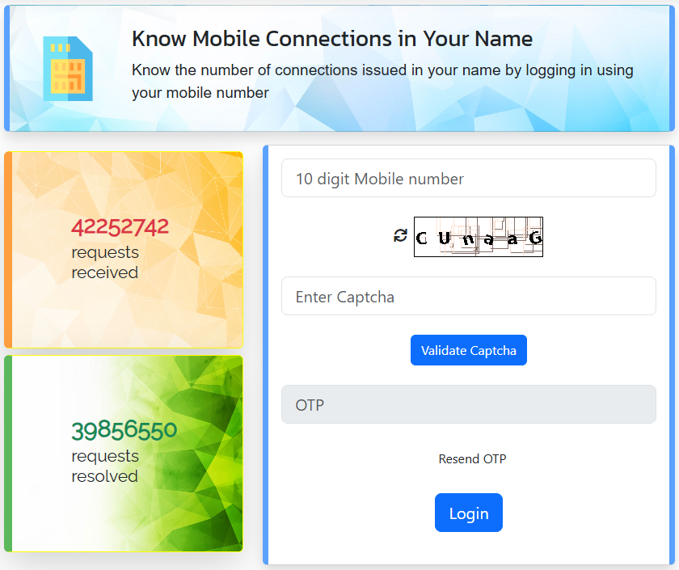

# How Many SIM Cards Are in Your Name? How to Check and Close the Ones You Don't Use

The government's "Know Mobile Connections in Your Name" check has handled more than 4.2 crore requests. It takes about two minutes: enter your mobile number on Sanchar Saathi, type the OTP, and you'll see every mobile connection that operators have recorded against your identity (your Aadhaar-based KYC, for most people), across Jio, Airtel, Vi and BSNL. That's how you find out how many SIM cards are on your Aadhaar.

The check itself is simple. What trips people up is the next step: deciding what to do with each number on the list, and knowing what happens after you report one. Most online guides get the rules wrong, including the limit on how many SIMs you're allowed. This guide covers both, using the Department of Telecommunications' own FAQ.

## How many SIMs one person can have

The limit is **9 mobile connections per person**, across all operators combined. In Jammu & Kashmir, Assam and the North-Eastern states it is **6**. That comes from the [Sanchar Saathi FAQ](https://sancharsaathi.gov.in/Home/index.jsp). You'll often see "10" quoted in videos and forwards, but the official figure is 9.

The limit is also being enforced more strictly now. In August 2026, the DoT told operators to [immediately suspend any connection activated beyond the limit](https://www.freepressjournal.in/tech/new-sim-rules-take-effect-across-india-dot-caps-mobile-connections-at-9-per-person-orders-real-time-checks-by-november-2026), checked against the department's Digital Intelligence Platform, with real-time checks due by 30 November 2026. The FAQ adds that if someone already holds more than the limit, the connections activated last are the ones disconnected.

So if you plan to buy a new SIM and you're at or near the limit, check your list first.

## Checking on the website, step by step

1. Open [Know Mobile Connections in Your Name](https://tafcop.sancharsaathi.gov.in/telecomUser/). You can also reach it from [sancharsaathi.gov.in](https://sancharsaathi.gov.in/Home/index.jsp) under **Citizen Centric Services**.
2. Enter a 10-digit mobile number that is yours and in your hand. The OTP goes to this number.
3. Type the captcha exactly, including capital and small letters, then click **Validate Captcha**.
4. Enter the OTP and click **Login**.

*The login page. The counters on the left were at 4,22,52,742 requests received and 3,98,56,550 resolved when we checked in September 2026. Source: sancharsaathi.gov.in*

After login you'll see the list of connections in your name. The HOW TO - PC channel shows each number partly hidden, with only the first two and last four digits visible. That's enough to recognise your own numbers without exposing them on screen. The session times out if you leave it idle, so keep your list of known numbers handy before you start.

### On the Sanchar Saathi app

The same check is in the Sanchar Saathi app on Android and iPhone. In the SS Tech Knowledge walkthrough, the app registered by sending a verification SMS from the SIM in the phone, rather than asking for an OTP. Allow the permissions it asks for, then open **Know Mobile Connections in Your Name**. The list and options are the same as on the website.

## Reading the list: what to do with each number

For each connection, you can mark it and submit a report. The FAQ describes two report options, **"This is not my number"** and **"Not required"**. The videos also show a third option, "Required", for numbers you want to keep; choosing it doesn't create a report.

Go through the numbers one by one. They'll usually fall into one of these groups:

| What the number is | What to choose | Why |
|---|---|---|
| Your own SIM, in use | Nothing, or "Required" | Leave it alone |
| A SIM a family member uses, taken on your ID | Usually nothing (see the family section below) | Reporting it would put their number through re-verification and possibly disconnect it |
| An old SIM of yours you no longer use or can't find | "Not required" | Flags it for closure; the SIM can't be re-verified by anyone else on your identity |
| A number you have never taken | "This is not my number" | Flags it as a possible misuse of your identity |

Once you submit, you can't change your choice for that number, and the portal won't let you report it again. You'll get a request ID on screen and by SMS. Take a screenshot of it. It's your record that you told the government the number wasn't yours, which matters if that number is ever linked to a crime.

To check progress later, log in the same way and track the request ID. The HOW TO - PC video shows the status as "In progress" until the operator acts.

## What happens after you report a number

This is where most guides go wrong. Some say the number closes in 7 days, others 15. The official process is slower, and it's a re-verification, not an instant block.

The operator flags the number and asks its user to prove their identity again. According to the FAQ, the operator compares the **user's photograph and a proof-of-identity document** with its records, and it doesn't have to be the same document used when the SIM was bought. If the number isn't successfully re-verified, it goes through this timeline:

| Stage | Official timeline |
|---|---|
| Outgoing calls and SMS suspended | within 30 days |
| Incoming services suspended | within 45 days |
| Disconnected, if re-verification fails | within 60 days |

People on international roaming, with a physical disability or in hospital can get an extra 30 days at each stage. While a number is flagged it also **can't be ported** to another operator until re-verification finishes, so a fraudster can't escape the check by switching networks.

What this means in practice:

- **An unknown SIM in your name won't vanish overnight.** Expect weeks, not days.
- **Someone else can't keep a number on your identity by passing re-verification**, because they'd need your face and your ID. The Sarkari DNA video makes the same point.
- **An old SIM of yours marked "Not required"** will simply fail re-verification and close, since nobody is using it.

## SIMs your family uses in your name

In many Indian households, one person's ID covers several SIMs: a parent's phone, a spouse's second number, a child's first SIM. The SS Tech Knowledge creator found five in his name, all used by family.

Legally, those connections are yours. The FAQ says mobile connections are **non-transferable**, and misuse of a SIM in your name can lead back to you. You have two clean options:

- **Keep it, knowingly.** If you trust the person and the SIM is in daily use, don't report it. Just make sure you know who uses each number, and count them against your limit of 9 (or 6).
- **Move it to their name.** The FAQ allows a change of name between **blood relatives or legal heirs**, with your no-objection, a new Customer Acquisition Form in their name, and a new SIM card. The number stays the same. Do this at the operator's store.

Don't mark a family member's SIM as "This is not my number". It would trigger re-verification, and since they'd be verifying against your records, their number would likely be cut off.

<!-- AUTHOR: If your own family has SIMs spread across one person's ID (common in many homes), a sentence on how you sorted it out would make this section feel real. -->

## If you find a number you never took

1. **Report it as "This is not my number"** and save the request ID screenshot.
2. **Think about how it could have happened.** A common route is a photocopy of your ID handed over for some unrelated purpose. Our guide to [how UPI fraud happens](https://techpulzo.in/how-upi-fraud-actually-happens-the-five-warning-signs) explains why fraudsters want numbers that can't be traced back to them.
3. **Consider a police complaint if you suspect forgery.** The FAQ says a police complaint or FIR is lodged against anyone who got connections on forged documents. Under [Section 42(3)(e) of the Telecommunications Act, 2023](https://www.advocatekhoj.com/library/bareacts/telecommunications/42.php), obtaining a SIM "through fraud, cheating or personation" can bring up to three years in prison, a fine of up to ₹50 lakh, or both. A police complaint on record also protects you if the number was used for a crime.
4. **If you've already lost money, report it separately.** Call the cyber-crime helpline **1930** or file at cybercrime.gov.in. Sanchar Saathi's own FAQ points people there, because its Chakshu fraud-reporting tool is for suspicious calls and messages, not for money that's already gone.

For the scam calls and SMS that often come from such numbers, see our guide to [the phone settings that cut spam calls and SMS](https://techpulzo.in/how-to-stop-spam-calls-and-sms-on-an-indian-sim-the-settings-that-actually-help).

## Mistakes to avoid

- **Assuming the limit is 10.** It's 9 (6 in J&K, Assam and the North-East), and new SIMs beyond it are now being suspended.
- **Reporting a family member's working SIM as "not my number".** Use the name-change route instead.
- **Expecting a reported number to stop the same day.** Outgoing services take up to 30 days to stop, and full disconnection up to 60.
- **Trying to port a number you've just reported.** Flagged numbers can't be ported until re-verification is done.
- **Not saving the request ID.** It's the only proof of when you reported the number.
- **Checking once and forgetting.** Run the check again every few months, and after any time you've handed over copies of your ID.

## Frequently asked questions

### Does this only show SIMs linked to my Aadhaar?

The FAQ describes the list as mobile connections "taken in your name", across all operators. It's based on the identity records operators hold, which for most people include Aadhaar-based e-KYC. It isn't limited to one document type. The DoT doesn't publish exactly how it matches connections to a person, so if you've used different ID documents over the years, it's worth checking from more than one of your numbers.

### How many SIM cards can I have in my name in India?

Nine in total across all operators, or six if you're in Jammu & Kashmir, Assam or the North-Eastern states. Since August 2026, operators have been told to suspend any new connection that takes someone over the limit.

### How long does it take for a reported number to be closed?

Outgoing services are suspended within 30 days, incoming within 45, and the connection is disconnected within 60 days if re-verification fails. There's an extra 30 days per stage for people on international roaming, with a disability, or in hospital.

### Can I close my own old SIM this way instead of visiting a store?

Yes. Marking it "Not required" flags it for re-verification, and since nobody will re-verify it, it goes through suspension and then disconnection. If you want it closed faster, or need a formal closure receipt, ask your operator to deactivate it.

### Can someone be arrested for a SIM taken in my name?

The person who obtained it by fraud or impersonation is the one committing an offence under Section 42(3)(e) of the Telecommunications Act. Reporting the number, keeping your request ID, and filing a police complaint if you suspect forgery all create a record that you weren't involved.

## A two-minute check worth repeating

Most people find nothing alarming: their own numbers, perhaps an old SIM they forgot, perhaps a parent's phone. That's still useful to know. It's also why the check deserves a place alongside other habits like changing a leaked password: run it every few months, close what you don't use, and move family SIMs into the names of the people who actually use them.
