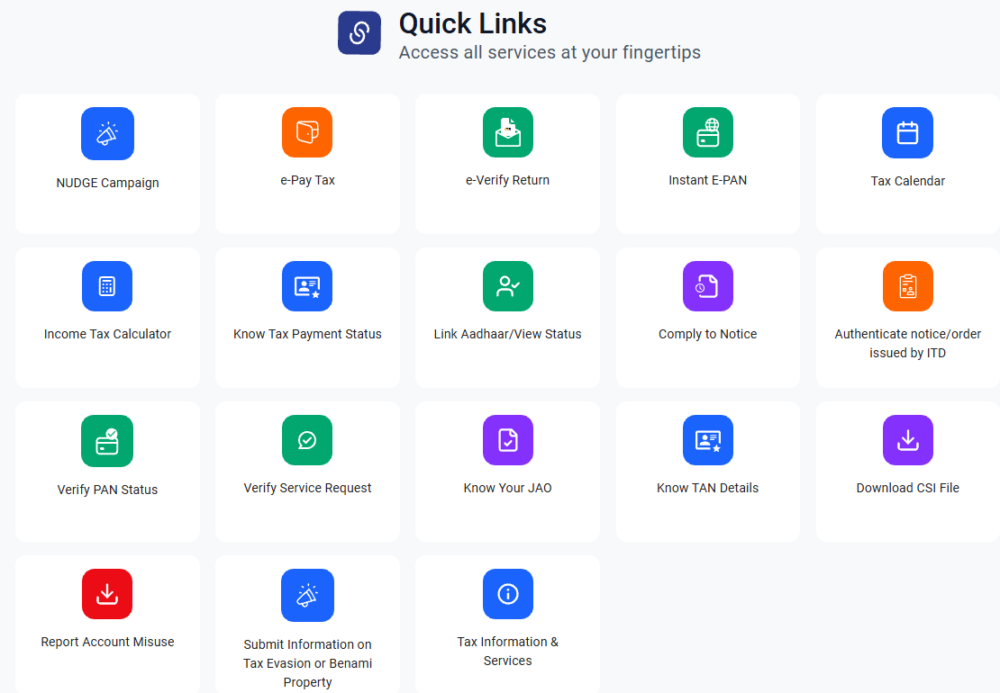

# How to Check Your PAN-Aadhaar Link Status, and Link Them if They Aren't

Start by checking, not paying. Many people who worry about PAN-Aadhaar linking are already linked. Anyone who applied for a PAN using Aadhaar in recent years was linked automatically, and many others linked before the deadlines. The status check on the Income Tax portal takes a minute and needs no login.

If you aren't linked, the fix costs ₹1,000 and has a waiting period most guides get wrong. Done in the wrong order, it can also cost you the fee with nothing to show for it. Here is the order that works, based on the Income Tax Department's own user manual, which was updated for the new Income-tax Act, 2025.

## Do you need to link at all?

Linking is mandatory under section 139AA of the Income-tax Act, 1961, carried into **section 262 of the Income-tax Act, 2025**, for anyone who was allotted a PAN **on or before 1 July 2017** and is eligible for Aadhaar ([user manual](https://www.incometax.gov.in/iec/foportal/help/all-topics/e-filing-services/link-aadhaar-um)). Newer PANs issued through an Aadhaar-based application are linked during the application.

According to the department's [Link Aadhaar page](https://www.incometax.gov.in/iec/foportal/help/all-topics/e-filing-services/link-aadhaar), you're **exempt** if you are:

- living in **Assam, Jammu and Kashmir, or Meghalaya**
- a **non-resident** under the Income-tax Act
- aged **80 or more** at any time during the previous year
- **not an Indian citizen**

One group had a separate deadline. People whose PAN was allotted using an **Aadhaar Enrolment ID** (before they had an Aadhaar number) had until **31 December 2025** to link it, under Notification 26/2025. Their PANs became inoperative from 1 January 2026 if they didn't.

## Step 1: Check your status

1. Go to the e-Filing portal, [incometax.gov.in](https://www.incometax.gov.in/iec/foportal/), and scroll down to **Quick Links**.
2. Click **Link Aadhaar/View Status**, then **Continue** under **View Status**.
3. Enter your PAN and Aadhaar number and click **View Link Aadhaar Status**.

*Everything in this guide starts from these Quick Links: Link Aadhaar/View Status, e-Pay Tax for the fee, and Know Your JAO if your PAN is linked to the wrong Aadhaar. Source: incometax.gov.in*

You'll see one of these:

| Message says | What it means | What to do |
|---|---|---|
| Your PAN is already linked to the given Aadhaar | Done | Nothing |
| Linking request is in progress / pending with UIDAI | Submitted, not yet validated | Check again after a few days |
| PAN not linked with Aadhaar | Not linked | Continue to Step 2 |
| PAN linked with some other Aadhaar, or the reverse | A wrong link exists | See "Linked to the wrong Aadhaar" below |

You can also check after logging in, under **My Profile > Link Aadhaar Status**.

## Step 2: Before paying, make sure your details match

The link is validated against Aadhaar records, and a mismatch is the most common reason it fails. The creators we watched (including two Tamil channels) all stress checking these before paying: **name** (spelling, initials, order), **date of birth**, and **gender**. If PAN shows "R. Kumar" and Aadhaar shows "Kumar Ramesh", fix one of them first.

- To correct PAN details, use the "Changes or Correction in existing PAN Data" application on [Protean's PAN services](https://www.onlineservices.proteantech.in/paam/endUserRegisterContact.html) (formerly NSDL) or through UTIITSL. Protean's form notes that the name as per Aadhaar is what gets printed on the new PAN card.
- To correct Aadhaar details, see UIDAI's [guidance on updating Aadhaar data](https://uidai.gov.in/en/updating-data-on-aadhaar), which treats wrong date-of-birth and gender entries as enrolment errors that can be corrected.

Correct whichever document is wrong, wait for the update to go through, and only then pay. The fee is for the delay in linking, not for a successful link, so don't count on getting it back if linking fails.

## Step 3: Pay the ₹1,000 fee

The user manual lays out the payment path:

1. On the portal, click **Link Aadhaar**, then **Continue**, enter PAN and Aadhaar, and click **Validate**.
2. If you haven't paid, you'll see "Payment details not found". Click **Continue to Pay Through e-Pay Tax**.
3. Select the applicable Act (the manual now says **Income Tax Act, 2025**) and continue.
4. Enter your PAN twice and any valid mobile number, then verify with the OTP.
5. On the e-Pay Tax page, choose the **Income Tax** tile.
6. Select the relevant **Tax Year**, **Type of Payment: Other Receipts (500)**, and **Sub-type: Fee for delay in linking PAN with Aadhaar**. The ₹1,000 is filled in automatically.
7. Choose a payment mode (net banking, debit card, UPI and others), pay, and **download the challan**.

The Sarkari DNA walkthrough makes a point worth repeating: the bank list at the payment step doesn't require an account with that bank, and UPI works.

## Step 4: Wait, then submit the link request

Paying the fee does **not** link your PAN. You have to come back and submit the link request, and the official manual says that if you've paid, **wait 4–5 working days** before submitting. Some videos say a couple of hours. Occasionally that's enough, but the official figure is days, and submitting too early just gets you "Payment details not found" again.

Then:

1. Go back to **Link Aadhaar** (from Quick Links, or **Profile > Link Aadhaar** after login).
2. Enter PAN and Aadhaar and click **Validate**. You should now see "Your payment details are verified". Click **Continue**.
3. Enter your name **as it appears on Aadhaar** and your mobile number. The Sarkari DNA video points out a box for people whose Aadhaar shows only the **year of birth**, as some older cards do. Tick it only if that applies to you.
4. Click **Link Aadhaar**, enter the 6-digit OTP, and submit.
5. Check the status again after a few days. The manual notes the request may be pending with UIDAI for validation.

<!-- AUTHOR: If you've gone through the fee-and-link process yourself (or helped a parent through it), a sentence on how long it actually took to reflect would be more useful here than any video's estimate. -->

## What an inoperative PAN does to you

The PAN still exists, but the department treats it as not working for key purposes. The official [Link Aadhaar page](https://www.incometax.gov.in/iec/foportal/help/all-topics/e-filing-services/link-aadhaar) lists four consequences:

1. **No tax refunds** while the PAN is inoperative.
2. **No interest** on those refunds for that period.
3. **TDS at a higher rate** (under the higher-rate provision, section 206AA of the 1961 Act).
4. **TCS at a higher rate** (section 206CC).

The TDS point is the one people notice. If your bank deducts tax on FD interest, or a buyer deducts TDS on a property sale, a higher rate applies while your PAN is inoperative. Our guide to [fixed deposits vs recurring deposits](https://techpulzo.in/the-real-difference-between-a-fixed-deposit-and-a-recurring-deposit) covers when TDS applies to deposit interest.

### The two-month window that can undo higher TDS

CBDT **Circular 9/2025** (21 July 2025) gave relief to people who fix their PAN quickly ([Taxmann summary](https://www.taxmann.com/post/blog/no-higher-tds-tcs-if-pan-becomes-operative-within-time-cbdt)). For payments made **on or after 1 August 2025**, the person deducting tax isn't treated as having under-deducted if your PAN becomes operative **within two months from the end of the month** in which you were paid.

**Worked example.** Suppose your bank credits FD interest on 10 December while your PAN is inoperative. The window ends two months after 31 December, on the last day of February. If your PAN becomes operative by then, the deductor can file a correction and doesn't have to pass the higher TDS on to you. The CA Monica video explains this correction step from the deductor's side. Remember the 4–5 working-day wait after paying the fee, and start early in the window.

(For payments between 1 April 2024 and 31 July 2025, the deadline under the same circular was 30 September 2025. That has passed.)

The circular was issued under the 1961 Act. Since the Income-tax Act, 2025 took effect, ask your employer's payroll team or a tax professional whether equivalent relief applies to current-year deductions, rather than assuming it does.

## Common problems and fixes

| Problem | Likely cause | Fix |
|---|---|---|
| "Payment details not found" after paying | Payment not yet reflected | Wait 4–5 working days, then retry |
| Linking fails validation | Name, date of birth or gender mismatch | Correct PAN or Aadhaar first, then retry |
| "PAN linked with some other Aadhaar" (or the reverse) | A wrong link exists | Contact your Jurisdictional Assessing Officer (find them with **Know Your JAO** in Quick Links) to request delinking |
| Status shows pending for long | Awaiting UIDAI validation | Check again later; if it's still pending, call the e-filing helpdesk |

## Frequently asked questions

### How do I know if my PAN is inoperative?

Check the Link Aadhaar status as above. If it says your PAN isn't linked and you're not in an exempt category, treat it as inoperative. The Quick Links also have a **Verify PAN Status** service.

### How long after linking does my PAN become operative again?

Once the link request is validated. The manual says a request may be pending with UIDAI for a while, so check the status after a few days rather than expecting it the same day.

### Can I open a bank account or invest with an inoperative PAN?

The four official consequences are about refunds, refund interest, and higher TDS and TCS. A bank's account-opening KYC is a separate process, as the Easy Financial Express video points out. But financial institutions verify your PAN, and an inoperative one invites questions and delays, so link before you need these services. If you're planning to start investing, like the choices in our [SIP vs lump sum guide](https://techpulzo.in/sip-vs-lump-sum-how-to-actually-decide-where-to-put-your-money), link first.

### Do NRIs need to link PAN and Aadhaar?

Non-residents are in the exempt list, so linking isn't compulsory. If the portal still shows your PAN as inoperative, contact the e-filing helpdesk or your Jurisdictional Assessing Officer, and have proof of your residential status ready.

### I paid the fee but made a mistake. Can I get a refund?

Don't count on it. The fee is for the delay in linking. That's why Step 2, matching your details before paying, matters.

## Check first, pay last

Most readers will stop at Step 1 with "already linked". If you don't, the whole process is four steps and about a week: fix any mismatch, pay, wait, link. The two mistakes that cost people money are paying before the details match, and giving up after trying to link an hour after paying.
