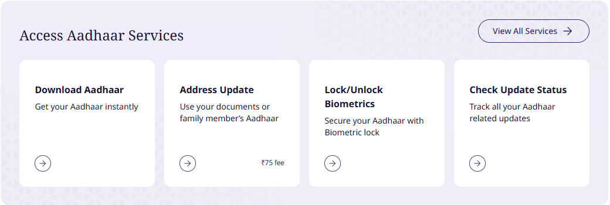

# Masked Aadhaar: What It Hides, How to Download It, and When to Use It

A masked Aadhaar is the same e-Aadhaar PDF you'd normally download, with one difference: the first eight digits of your Aadhaar number are replaced with "xxxx-xxxx", and only the last four show. UIDAI's own [FAQ](https://uidai.gov.in/en/aadhaar-online-services) defines it in exactly those terms. It's free, takes a couple of minutes, and it's the version to hand over when someone only needs to see that you are who you say you are.

What most guides skip is what masking doesn't do. This one covers that, plus the newer tools that protect you more than masking does.

## What masking hides, and what it doesn't

Masking hides **one thing: the first eight digits of your Aadhaar number.** Everything else on the card is still there:

- your name, photo, date of birth and gender
- your full address
- the QR code

That still matters. Your full 12-digit number is the key that links your identity across banks, telecom operators and government records, so limiting how many people hold it is sensible. But a masked copy is still a document with your photo, name and address on it. Treat it as personal data, not as something safe to post anywhere.

## How to download it

UIDAI's FAQ lists two official routes: the **myAadhaar portal** (myaadhaar.uidai.gov.in, via "Download Aadhaar") or the **Aadhaar app**. You can identify yourself with any of three numbers: your Aadhaar number, your enrolment ID, or a Virtual ID (VID). Either way, an OTP goes to your **registered mobile number**, so you need access to that number.

*UIDAI's home page links straight to Download Aadhaar and to the biometric lock, both covered below. Source: uidai.gov.in*

On the portal:

1. Open **Download Aadhaar** and enter your Aadhaar number (or enrolment ID or VID) and the captcha.
2. Request the OTP.
3. Choose the masked version. The walkthroughs we watched show a "masked Aadhaar" option on this screen; UIDAI's service list also names it "Download Masked Aadhaar".
4. Enter the OTP and download the PDF.

### Opening the PDF: the password

The file is password-protected. UIDAI's rule is: **the first four letters of your name in CAPITALS, followed by your year of birth (YYYY)**, using your name exactly as printed on the Aadhaar. UIDAI's own examples cover the cases that confuse people:

| Name on Aadhaar | Year of birth | Password |
|---|---|---|
| SURESH KUMAR | 1990 | SURE1990 |
| SAI KUMAR | 1990 | SAIK1990 (the space is skipped) |
| P. KUMAR | 1990 | P.KU1990 (the dot counts as a character) |
| RIA | 1990 | RIA1990 (short names use what's there) |

If the password fails, the usual reason is a name spelled differently from how it appears on the Aadhaar record, or a wrong year.

## Where to use the masked copy, and where you'll need more

A simple rule: **if someone only needs to see your ID, give the masked copy. If they need to verify or use your Aadhaar number, they'll ask for the full one, or for OTP or biometric authentication.**

Good places for the masked copy:

- hotel and guest-house check-ins
- visitor passes, gyms, clubs, housing society records
- a courier or a shop that asks for "any ID"
- rental and job applications at the stage where only identity proof is needed

Places where it's commonly refused:

- **Government schemes and benefit payments.** The Basic Gyaan and B Visitor channels both say masked copies aren't accepted for government schemes and direct benefit transfers. B Visitor describes a viewer whose masked copy was turned away at an exam centre. We didn't find a UIDAI page listing where masked copies are refused, so check with the organisation beforehand.
- Anything that authenticates you through Aadhaar: bank e-KYC, SIM e-KYC, or linking Aadhaar to PAN. These use the full number or a VID with OTP or biometrics.

Also worth knowing: UIDAI says a full e-Aadhaar is **"equally valid like physical copy of Aadhaar for all purposes"** under the Aadhaar Act. So if an office refuses a printout of your e-Aadhaar (unmasked) and insists on the laminated card, the rules are on your side.

## Tools that protect you more than masking

Masking limits who sees your number on paper. These tools limit what someone can do with it.

### Virtual ID (VID)

A VID is a **temporary, revocable 16-digit number** mapped to your Aadhaar. UIDAI's FAQ says you can use it instead of your Aadhaar number for authentication and e-KYC, and **your Aadhaar number can't be worked out from it**. Only you can generate a VID, and you can replace it with a new one whenever you like. When a service allows authentication by VID, use that instead of your Aadhaar number.

### Selective sharing in the Aadhaar app

UIDAI's [Aadhaar app](https://uidai.gov.in/en/aadhaar-app-faq) lets you share your Aadhaar details as a digitally signed "Verifiable Credential", **in full or in part, with your consent**. For example, you could share your name and photo without your address. The receiving organisation verifies it with the Aadhaar app or UIDAI's QR scanner. The app also downloads e-Aadhaar, shows your authentication history, and lets you manage up to five family profiles.

### Biometric lock

The app and the UIDAI website offer a **one-click biometric lock and unlock**. Keep it locked, and unlock it only when you need to authenticate with a fingerprint or face, for example at a bank or ration shop. That way nobody can use your biometrics to authenticate while it's locked. For the same reason, it helps to keep your email and other accounts protected with [two-factor authentication](https://techpulzo.in/how-two-factor-authentication-actually-stops-account-hacks), so a leak in one place doesn't lead to others.

<!-- AUTHOR: If you've been asked for Aadhaar at a hotel or office and offered the masked copy, a line on how they reacted would be a useful real-world note here. -->

## What happened to the "don't share photocopies" advisory

You may have seen a forward saying the government told people not to share Aadhaar photocopies. On 27 May 2022, UIDAI's Bengaluru regional office issued such an advisory. It recommended masked Aadhaar instead, and said [private entities like hotels or film halls weren't permitted to collect or keep Aadhaar copies](https://www.thequint.com/news/india/aadhaar-can-be-misused-only-share-masked-copies-says-uidai). The whole advisory was [withdrawn two days later](https://www.indiatvnews.com/news/india/aadhaar-card-photocopy-sharing-govt-withdraws-recent-advisory-uidai-boimetric-id-updates-2022-05-29-780265), on 29 May, over concern that it could be misinterpreted. The government's replacement advice was to "exercise normal prudence" when sharing Aadhaar.

In practice, that means sharing a masked copy when the full number isn't needed is still sensible. It just isn't an official rule that others are obliged to follow.

## Frequently asked questions

### Is a masked Aadhaar legally valid?

It's a UIDAI-issued e-Aadhaar, digitally signed, with only the number partly hidden. It works as proof of identity wherever the full number isn't needed. Where an organisation has to record or verify your full Aadhaar number, it can ask for the unmasked version or for authentication.

### Can I download masked Aadhaar without my registered mobile number?

No. Downloading needs an OTP on the mobile number registered with Aadhaar. If that number has changed, update your mobile number first. The Aadhaar app can update it, or you can visit an Aadhaar Seva Kendra.

### Why does my e-Aadhaar password not work?

Check that you're using the first four characters of your name exactly as printed on the Aadhaar, in capitals (dots count, spaces don't), followed by your four-digit birth year. For "P. KUMAR" born in 1990, UIDAI's example password is P.KU1990.

### Should I use a VID or a masked Aadhaar?

They do different jobs. A masked Aadhaar is a document to show. A VID is a number to authenticate with, for e-KYC or OTP-based verification. Use the masked copy when someone wants a printout, and the VID when a service lets you enter a number for authentication.

### Does the QR code on my e-Aadhaar still work?

Yes. UIDAI says QR codes on PVC cards and e-Aadhaar continue to work, and can be scanned with the Aadhaar app or UIDAI's QR code scanner for identity verification.

## Masking is the minimum, not the whole plan

Download a masked copy and keep it on your phone for everyday ID requests. That alone cuts down how many strangers hold your full number. Then do the two things that protect more: lock your biometrics in the Aadhaar app, and use a VID or the app's selective sharing wherever a service offers them.
