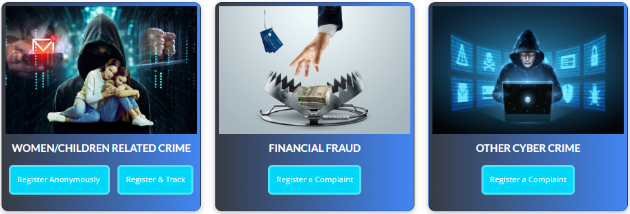
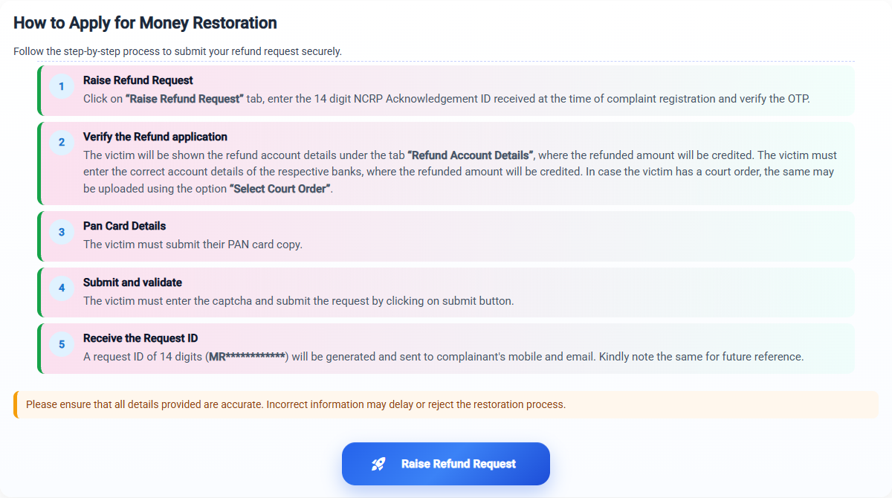

# Lost Money to an Online Scam? How to Report It in India and Get It Back

If money has just left your account through a scam, two separate clocks start. One is the fraudster moving your money from account to account until it can be withdrawn, which is why the first hour matters. The other is your bank's liability rules, which decide how much of the loss the bank has to cover, and they depend on how many days you take to report it.

So when you report cyber fraud in India, you need to do two things, and neither replaces the other: **report to the national cybercrime system to freeze the money**, and **report to your bank to trigger its liability rules.** This guide covers both, plus the ways introduced in 2026 to get frozen money back.

## The first hour: what to do, in order

1. **Call 1930**, the national cybercrime helpline, or file at [cybercrime.gov.in](https://cybercrime.gov.in/) under **Financial Fraud**. Reports go into a system that links more than 85 banks and payment companies, so the money can be put on hold in the accounts it has moved to. If 1930 is busy, the police officer behind the CopShashank17 channel suggests retrying from other phones in the house rather than waiting.
2. **Call your bank** from its official number (printed on your card or passbook, or on its website, not from a search ad). Block the card or UPI and report the transaction as fraudulent. Ask for a complaint number, and follow up in writing by email or in the app, so the time you reported is on record.
3. **Save everything.** Take screenshots of the transaction, the UTR/reference number, the scam messages and call logs, the fraudster's number or UPI ID, and any links. Don't delete the chat, even if it's embarrassing.
4. **Change passwords and PINs** for anything the fraudster may have seen, like net banking, email and UPI, from a device you trust.

Speed matters because, as the Cyber Helper channel explains, a complaint is passed to bank nodal officers who put holds down the chain of accounts. Money that has already been withdrawn in cash can't be frozen.

## Filing the complaint on cybercrime.gov.in

The National Cyber Crime Reporting Portal (NCRP) has three sections. Scams that took money go under **Financial Fraud**.

*Money lost to a scam goes under Financial Fraud; hacked accounts and impersonation go under Other Cyber Crime. Source: cybercrime.gov.in*

The portal asks you to log in with a mobile number and OTP, then fill in:

- **Incident details:** the type of fraud (UPI, card, net banking, wallet and so on), whether you lost money, and a description.
- **Transaction details:** your bank or wallet, the **UTR / transaction ID**, amount, date and time. Get the time as close as you can.
- **Suspect details:** the fraudster's phone number, UPI ID, account number, website or social media handle, if you have any.
- **Evidence:** screenshots and documents.

Take it slowly. The Cyber Helper video warns that people panic and swap the victim and suspect fields, which can end with the wrong account being held. Your details go in your fields and the fraudster's in theirs.

When you submit, you get an **acknowledgement number**. It's 14 digits, and you'll need it later to track the complaint and to claim a refund. Keep it somewhere safe.

The portal also has a **Suspect Repository**, where you can search whether a phone number, UPI ID, account or website has already been reported, and a **Report Suspect** option for scams you spotted but didn't fall for.

## What your bank owes you

This part changes on **1 January 2027**, so check which set of rules applies to the date of your transaction.

### Transactions before 1 January 2027: the 2017 rules

Under RBI's [July 2017 circular](https://www.rbi.org.in/commonman/english/scripts/Notification.aspx?Id=2336):

| Situation | Your liability |
|---|---|
| The bank was at fault (its fraud, negligence or deficiency) | **Zero**, whenever you report it |
| A third-party breach, neither your fault nor the bank's, reported within **3 working days** | **Zero** |
| The same, reported within **4–7 working days** | Limited to the transaction value or ₹5,000 (basic savings), ₹10,000 (savings, prepaid, small business current accounts) or ₹25,000 (other current accounts, credit cards over ₹5 lakh limit), whichever is lower |
| Reported after **7 working days** | As per your bank's board-approved policy |
| Loss caused by **your own negligence**, such as sharing an OTP or PIN | You bear the loss **until you report it**; anything after that is the bank's |

Once you report, the bank must credit the disputed amount to your account (a "shadow credit") within **10 working days**, and resolve the complaint within **90 days**. The **burden of proof is on the bank** to show you were responsible.

### Transactions from 1 January 2027: the new rules

In June 2026, RBI issued revised directions that apply to electronic transactions (cards, UPI and other transfers) on or after 1 January 2027. [As reported by MediaNama](https://www.medianama.com/2026/06/223-rbi-final-amendment-directions-limiting-customer-liability-digital-transactions-effect-2027/):

- **Zero liability** if the bank was negligent, or for a third-party breach reported within **5 calendar days**.
- Losses from **your negligence** remain yours until you report them.
- Banks must resolve complaints within **45 days** (60 days for cross-border transactions).
- **A new one-time compensation:** individuals with a gross loss of up to ₹50,000 can get **85% of the net loss or ₹25,000, whichever is lower, once in their lifetime**. This covers cases involving the customer's own negligence, and applies to frauds in the first year of the new rules, **provided you report to both your bank and the national cybercrime portal within 5 calendar days.**

That last condition is another reason to do both reports straight away.

One more thing from the Aaj Tak report: be truthful with your bank and the police, even if you shared an OTP. Inaccurate details can sink a claim, and under the 2027 rules even negligence cases can qualify for compensation.

## Getting frozen money back

A freeze stops the money leaving the fraudster's side. Getting it back to you is a separate step.

**The Money Restoration Module (MRM).** The Ministry of Home Affairs runs a portal, [mrm-ncrp.mha.gov.in](https://mrm-ncrp.mha.gov.in/public-info), where victims request refunds of money held after their complaint.

*The five steps to request a refund of held money. You need the acknowledgement number from your original complaint. Source: mrm-ncrp.mha.gov.in*

You'll need your 14-digit acknowledgement ID, OTP verification, the bank account for the refund, a PAN card copy, and a court order if you have one. You'll get a 14-digit request ID starting "MR" to track it. Moneylife has reported that about a lakh people have benefited from the government's restoration mechanisms so far.

**Small amounts without a court order.** Under an MHA standard operating procedure from January 2026, [refunds for frauds below ₹50,000 can be processed without a court order](https://www.drishtiias.com/daily-updates/daily-news-analysis/mhas-new-sop-on-cyber-financial-frauds). The same SOP says that if there's no court or restoration order, banks must lift a freeze within 90 days. So don't let a small-amount claim sit idle.

**Larger amounts.** Here you may still need a magistrate's order releasing the held money to you. The Online Legal Center video (by a practising advocate) describes filing an application before the magistrate with proof that the frozen money is yours, and cites BNSS sections 497 and 503, which replaced the old CrPC provisions. For amounts where this applies, talk to a lawyer rather than relying on a video.

## If the bank doesn't help

If your bank doesn't reply within **30 days**, or you're unhappy with its answer, complain to the RBI Ombudsman under the [Integrated Ombudsman Scheme, 2026](https://www.rbi.org.in/commonman/english/scripts/FAQs.aspx?Id=3407) (in force since 1 July 2026). File at **cms.rbi.org.in** or call **14448**, within 90 days of the bank's deadline or its last reply. It's free.

<!-- AUTHOR: If you know someone who went through a 1930 complaint (successful or not), a short, anonymised account of how long each step took would be more valuable here than anything general. -->

## Mistakes that cost people their money

- **Reporting only to the bank, or only to 1930.** The freeze and the liability rules run separately, and the 2027 compensation needs both.
- **Waiting to "see if it comes back".** For liability, 3 working days (now) or 5 calendar days (from 2027) is the line that matters.
- **Mixing up victim and suspect details** on the portal.
- **Paying a "recovery agent".** People who contact you promising to get your money back for a fee are often running a second scam. The official routes (1930, the portal, MRM, your bank, the RBI Ombudsman) don't charge.
- **Losing the acknowledgement number.** Every later step needs it.

To avoid a repeat, our guide to [how UPI fraud happens](https://techpulzo.in/how-upi-fraud-actually-happens-the-five-warning-signs) covers the five warning signs these scams share.

## Frequently asked questions

### Is 1930 the same as the police?

1930 is the national helpline for financial cyber fraud, run under the Ministry of Home Affairs' cybercrime system. It records your complaint and starts the process of holding the money. The complaint is then typically passed to the cyber police in your state, who may contact you for a statement.

### How much time do I have to report to my bank?

For transactions before 1 January 2027, report within 3 working days for zero liability in third-party fraud (4–7 working days gets you limited liability). From 1 January 2027, the zero-liability window is 5 calendar days. Report the same day if you can.

### I shared my OTP. Do I get nothing back?

Under the current rules, a loss caused by your own negligence is yours until you report it, and the bank covers anything after that. But the freeze through 1930 can still recover money, whoever was at fault. And from 2027, losses up to ₹50,000 involving customer negligence can qualify for one-time compensation if reported to both the bank and the portal within 5 days.

### How long does a refund take?

It depends on how quickly the money was frozen and on the amount. Under the January 2026 SOP, amounts below ₹50,000 don't need a court order. Larger ones may. Use the MRM portal to request and track the refund.

### Can I file a complaint if I didn't lose money?

Yes. Hacked accounts, impersonation and harassment go under "Other Cyber Crime". You can also report a suspicious number, UPI ID or website through "Report Suspect".

## Two reports, same day

The one habit that decides most outcomes: report to 1930 or the cybercrime portal **and** to your bank, on the same day, and keep both reference numbers. The first gives the money a chance of being held. The second protects your rights with the bank, and from 2027 unlocks compensation too.
